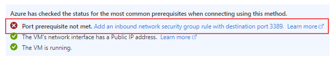
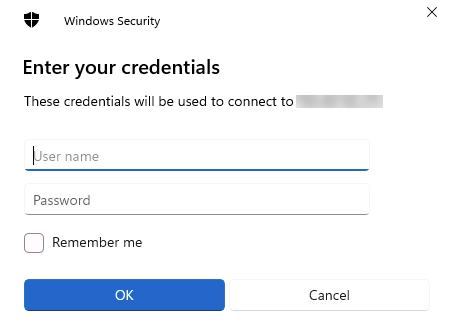

---
lab:
  title: "Labo\_1\_: Provisionner SQL Server sur une machine virtuelle Azure"
  module: Plan and Implement Data Platform Resources
---

# Provisionner une instance de SQL Server sur une machine virtuelle Azure

**Durée estimée : 30 minutes**

Les participants exploreront le Portail Azure et l’utiliseront pour créer une machine virtuelle Azure avec SQL Server 2019 installé. Ils se connecteront ensuite à la machine virtuelle via le protocole de bureau à distance.

Vous êtes administrateur de base de données pour AdventureWorks. Vous avez besoin de créer un environnement de test à utiliser dans une preuve de concept. La preuve de concept utilisera SQL Server sur une machine virtuelle Azure et une sauvegarde de la base de données AdventureWorksDW. Vous devez configurer la machine virtuelle, restaurer la base de données et l’interroger pour vous assurer qu’elle est disponible.

## Déployer SQL Server sur une machine virtuelle Azure

1. Depuis la machine virtuelle du labo, démarrez une session de navigation et naviguez vers [https://portal.azure.com](https://portal.azure.com/), puis connectez-vous à l’aide du compte Microsoft associé à votre abonnement Azure.

    

1. Repérez la barre de recherche située en haut de la page. Recherchez **Azure SQL**. Sélectionnez le résultat de recherche **Azure SQL** qui apparaît sous **Services**.

    

1. Dans le panneau **Azure SQL**, sélectionnez **Créer**.

    

1. Dans le volet **Sélectionner l’option de déploiement SQL**, cliquez sur la zone de liste déroulante sous **Machines virtuelles SQL**. Sélectionnez l’option intitulée **Licence SQL Server gratuite : SQL 2019 Développeur sur Windows Server 2022**. Sélectionnez ensuite **Créer**.

    

1. Sur la page **Créer une machine virtuelle**, entrez les informations suivantes :

    - **Abonnement** : &lt;votre abonnement&gt;.
    - **Groupe de ressources** : &lt;votre groupe de ressources.&gt;
    - **Nom de machine virtuelle** : azureSQLServerVM
    - **Région :** &lt;votre région locale, identique à la région sélectionnée pour votre groupe de ressources.&gt;
    - **Options de disponibilité** : Aucune redondance d’infrastructure requise
    - **Image :** licence SQL Server gratuite, SQL 2019 Développeur sur Windows Server 2022 (Gen1)
    - **Instance spot Azure :** Non (non coché)
    - **Taille :** *D2s_v3* standard (2 processeurs virtuels, 8 Gio de mémoire). Vous devrez peut-être sélectionner le lien « Afficher toutes les tailles » pour voir cette option.
    - **Nom d’utilisateur du compte administrateur** : sqladmin
    - **Mot de passe du compte administrateur** : pwd!DP300lab01 (ou votre propre mot de passe qui répond aux critères)
    - **Sélectionner les ports d’entrée** : RDP (3389)
    - **Souhaitez-vous utiliser une licence Windows Server existante ?**  : non (non coché)

    Notez le nom d’utilisateur et le mot de passe pour une utilisation ultérieure.

    

1. Accédez à l’onglet **Disques** et passez en revue la configuration.

    

1. Accédez à l’onglet **Réseaux** et passez en revue la configuration.

    

1. Accédez à l’onglet **Administration** et passez en revue la configuration.

    

    Vérifiez que l’option **Activer auto_shutdown** n’est pas cochée.

1. Accédez à l’onglet **Avancé** et passez en revue la configuration.

    

1. Accédez à l’onglet **Paramètres SQL Server** et passez en revue la configuration.

    

    **Remarque** : vous pouvez aussi configurer le stockage de votre machine virtuelle SQL Server dans cet écran. Par défaut, les modèles de machine virtuelle Azure SQL Server créent un seul disque Premium avec une mise en cache en lecture des données, un seul disque premium sans mise en cache du journal des transactions, et utilise le disque SSD local (D:\ sur Windows) pour tempdb.

1. Sélectionnez le bouton **Vérifier + Créer**. Sélectionnez ensuite **Créer**.

    

1. Dans le volet de déploiement, attendez que le déploiement soit terminé. Le déploiement de la machine virtuelle prend entre 5 et 10 minutes environ. Une fois le déploiement effectué, sélectionnez **Accéder à la ressource**.

    **Remarque** : votre déploiement peut prendre plusieurs minutes.

    

1. Sur la page **Vue d’ensemble** de la machine virtuelle, explorez les options de menu pour cette ressource afin d’examiner les possibilités qui s’offrent à vous.

    

## Se connecter à SQL Server sur une machine virtuelle Azure

1. Sur la page **Vue d’ensemble** de la machine virtuelle, sélectionnez le bouton **Se connecter**, puis RDP.

    

1. Sous l’onglet RDP, sélectionnez le bouton **Télécharger le fichier RDP**.

    

    **Remarque :** si le message d’erreur **Prérequis du port non rempli** s’affiche, veillez à sélectionner le lien permettant d’ajouter une règle de groupe de sécurité réseau entrant avec le port de destination mentionné dans le champ *Numéro de port*.

    

1. Ouvrez le fichier RDP qui vient d’être téléchargé. Lorsqu’une boîte de dialogue apparaît pour vous demander si vous souhaitez vous connecter, sélectionnez **Se connecter**.

    

1. Saisissez le nom d’utilisateur et le mot de passe sélectionnés lors du processus d’approvisionnement de la machine virtuelle. Sélectionnez ensuite **OK**.

    

1. Lorsque la boîte de dialogue **Connexion au bureau à distance** apparaît et vous demande si vous voulez vous connecter, sélectionnez **Oui**.

    

1. Sélectionnez le bouton Démarrer de Windows et tapez SSMS. Sélectionnez **Microsoft SQL Server Management Studio** dans la liste.  

1. Lorsque SSMS s’ouvre, notez que la boîte de dialogue **Se connecter au serveur** est préremplie avec le nom de l’instance par défaut. Sélectionnez **Se connecter**.

    

Le portail Azure vous offre des outils puissants pour gérer une instance de SQL Server hébergée sur une machine virtuelle. Ces outils permettent de contrôler les mises à jour correctives automatisées et les sauvegardes automatisées, ainsi que de configurer facilement la haute disponibilité.
