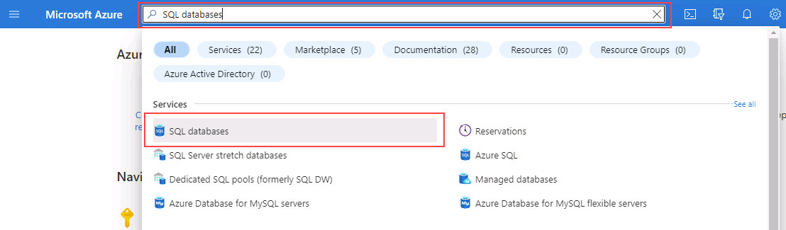
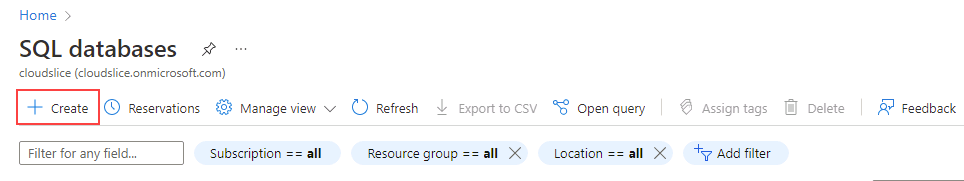

---
lab:
  title: "Labo\_2\_: Provisionner une base de données Azure SQL"
  module: Plan and Implement Data Platform Resources
---

# Provisionner une base de données Azure SQL

**Durée estimée : 40 minutes**

Les participants configureront les ressources de base nécessaires au déploiement d’une base de données Azure SQL avec un point de terminaison de réseau virtuel. La connectivité à la base de données SQL sera validée à l’aide d’Azure Data Studio à partir de la machine virtuelle du labo.

En tant qu’administrateur de base de données pour AdventureWorks, vous allez configurer une nouvelle base de données SQL Database, avec un point de terminaison de réseau virtuel pour augmenter et simplifier la sécurité du déploiement. Azure Data Studio permet d’évaluer l’utilisation d’un notebook SQL pour l’interrogation des données et la rétention des résultats.

## Accéder au Portail Azure

1. Depuis la machine virtuelle du labo, démarrez une session de navigateur et naviguez vers [https://portal.azure.com](https://portal.azure.com/). Connectez-vous au portail à l’aide du **nom d’utilisateur** et du **mot de passe** Azure fournis dans l’onglet **Ressources** de cette machine virtuelle de labo.

    

1. Depuis le Portail Azure, recherchez « Groupes de ressources » dans la zone de recherche située en haut, puis sélectionnez **Groupes de ressources** dans la liste des options.

    

1. Sur la page **Groupe de ressources**, vérifiez le groupe de ressources répertorié (il doit commencer par *contoso-rg*). Notez l’**emplacement** attribué à votre groupe de ressources, car vous l’utiliserez dans l’exercice suivant.

    **Remarque :** il se peut qu’un autre emplacement vous ait été affecté.

    

## Création d'un réseau virtuel

1. Sur la page d’accueil du Portail Azure, sélectionnez le menu de gauche.  

    

1. Dans le volet de navigation gauche, cliquez sur **Réseaux virtuels**  

1. Cliquez sur **+ Créer** pour ouvrir la page **Créer un réseau virtuel**. Sous l’onglet **Informations de base**, fournissez les informations suivantes :

    - **Abonnement** : &lt;Votre abonnement&gt;
    - **Groupe de ressources** : doit commencer par *contoso-rg*.
    - **Nom :** lab02-vnet
    - **Région :** sélectionnez la même région que celle dans laquelle votre groupe de ressources a été créé

1. Cliquez sur **Vérifier + créer**, vérifiez les paramètres du nouveau réseau virtuel, puis cliquez sur **Créer**.

1. Configurez la plage d’adresses IP du réseau virtuel pour le point de terminaison de la base de données Azure SQL en naviguant vers le réseau virtuel créé et, dans le volet **Paramètres**, cliquez sur **Sous-réseaux**.

1. Cliquez sur le lien du sous réseau **par défaut**. Notez que la **plage d’adresses de sous-réseau** que vous voyez peut être différente.

1. Dans le volet **Modifier le sous-réseau** sur la droite, développez la liste déroulante **Services**, puis sélectionnez **Microsoft.Sql**. Sélectionnez **Enregistrer**.

## Provisionner une base de données Azure SQL

1. Dans le Portail Azure, recherchez « Bases de données SQL » dans le champ de recherche situé en haut de la page, puis cliquez sur **Bases de données SQL** dans la liste des options.

    

1. Sur la page panneau **Bases de données SQL**, sélectionnez **+ Créer**.

    

1. Sur la page **Créer une base de données SQL**, sélectionnez les options suivantes dans l’onglet **Informations de base**, puis cliquez sur **Suivant : Mise en réseau**.

    - **Abonnement** : &lt;Votre abonnement&gt;
    - **Groupe de ressources** : doit commencer par *contoso-rg*.
    - **Nom de la base de données** : AdventureWorksLT
    - **Serveur :** cliquez sur **Créer un lien**. La page **Créer un serveur SQL Database** s’ouvre. Fournissez les détails du serveur comme suit :
        - **Nom du serveur** : dp300-lab-&lt;vos initiales (en minuscules)&gt; (Un nom de serveur doit être globalement unique.)
        - **Emplacement :** &lt;votre région locale, identique à la région sélectionnée pour votre groupe de ressources, sinon l’opération risque d’échouer.&gt;
        - **Méthode d’authentification** : utilisez l’authentification SQL.
        - **Identifiant de connexion au serveur de l’administrateur** : dp300admin
        - **Mot de passe** : dp300P@ssword!
        - **Confirmer le mot de passe** : dp300P@ssword!

        Votre page **Créer un serveur SQL Database** doit ressembler à celle ci-dessous. Cliquez ensuite sur **OK**.

        

    -  Retournez à la page **Créer une base de données SQL** et assurez-vous que l’option **Voulez-vous utiliser le pool élastique ?** est définie sur **Non**.
    -  Dans l’option **Calcul + stockage**, cliquez sur le lien **Configurer la base de données**. Sur la page **Configurer**, dans le menu déroulant **Niveau de service**, sélectionnez **De base**, puis **Appliquer**.

    **Remarque** : notez ce nom de serveur et vos identifiants de connexion. Vous allez l’utiliser dans les labos suivants.

1. Pour l’option **Redondance du stockage de sauvegarde**, conservez la valeur par défaut : **Stockage de sauvegarde géoredondant**.

1. Cliquez sur **Suivant : Mise en réseau**.

1. Dans l’onglet **Mise en réseau**, pour l’option **Connectivité du réseau**, cliquez sur le bouton d’option **Point de terminaison privé**.

    

1. Cliquez ensuite sur le lien **+ Ajouter un point de terminaison privé** sous l’option **Points de terminaison privés**.

    

1. Complétez le volet droit **Créer un point de terminaison privé** comme suit :

    - **Abonnement** : &lt;Votre abonnement&gt;
    - **Groupe de ressources** : doit commencer par *contoso-rg*.
    - **Emplacement :** &lt;votre région locale, identique à la région sélectionnée pour votre groupe de ressources, sinon l’opération risque d’échouer.&gt;
    - **Nom :** DP-300-SQL-Endpoint
    - **Sous-ressource cible** : SqlServer
    - **Réseau virtuel (Vnet)**  : lab02-vnet
    - **Sous-réseau :** lab02-vnet/default (10.x.0.0/24)
    - **Intégrer à une zone DNS privée** : Oui
    - **Zone DNS privé :** conserver la valeur par défaut
    - Vérifiez les paramètres, puis cliquez sur **OK**.  

    

1. Le nouveau point de terminaison apparaît dans la liste des **Points de terminaison privés**.

    

1. Cliquez sur **Suivant : Sécurité**, puis sur **Suivant : Paramètres supplémentaires**.  

1. Sur la page **Paramètres supplémentaires**, sélectionnez **Échantillon** dans l’option **Utiliser des données existantes**. Sélectionnez **OK** si un message contextuel s’affiche pour l’échantillon de base de données.

    

1. Cliquez sur **Revoir + créer**.

1. Vérifiez les paramètres, puis cliquez sur **Créer**.

1. Une fois le déploiement terminé, cliquez sur **Accéder à la ressource**.

## Activer l’accès à une base de données Azure SQL

1. Sur la page de la **Base de données SQL**, sélectionnez la section **Vue d’ensemble**, puis le lien du nom du serveur dans la section supérieure :

    

1. Sur le panneau de navigation des serveurs SQL, sélectionnez **Mise en réseau** dans la section **Sécurité**.

    

1. Dans l’onglet **Accès public**, sélectionnez **Réseaux sélectionnés**, puis cochez la propriété **Autoriser les services et ressources Azure à accéder à ce serveur**. Cliquez sur **Enregistrer**.

    

## Connectez-vous à une base de données Azure SQL avec Azure Data Studio

1. Lancez Azure Data Studio à partir de la machine virtuelle du labo.

    - Il se peut que cette fenêtre contextuelle s’affiche lors du lancement initial d’Azure Data Studio. Si c’est le cas, cliquez sur **Oui (recommandé)**.  

        

1. Lorsque Azure Data Studio s’ouvre, cliquez sur le bouton **Connections** dans le coin supérieur gauche, puis sur **Ajouter une connexion**.

    

1. Dans la barre latérale des **connexions**, renseignez la section **Détails de connexion** avec les informations de connexion pour vous connecter à la base de données SQL créée précédemment.

    - Type de connexion : **Microsoft SQL Server**
    - Serveur : saisissez le nom du serveur SQL créé précédemment. Par exemple : **dp300-lab-xxxxxxxx.database.windows.net** (où « xxxxxxxx » est un nombre aléatoire).
    - Type d’authentification : **Connexion SQL**
    - Nom d’utilisateur : **dp300admin**
    - Mot de passe : **dp300P@ssword!**
    - Développez la liste déroulante Base de données pour sélectionner **AdventureWorksLT**. 
        - **REMARQUE :** il vous sera peut-être demandé d’ajouter une règle de pare-feu autorisant votre adresse IP client à accéder à ce serveur. Si vous êtes invité à ajouter une règle de pare-feu, cliquez sur **Ajouter un compte** et connectez-vous à votre compte Azure. Sur l’écran **Créer une règle de pare-feu**, cliquez sur **OK**.

        

        Vous pouvez également créer manuellement une règle de pare-feu pour votre serveur SQL sur le Portail Azure en accédant à votre serveur SQL, en sélectionnant **Mise en réseau**, puis **+ Ajouter votre adresse IPv4 client (votre adresse IP)**.

        

    Retournez à la barre latérale Connexion et continuez à remplir les informations de connexion :  

    - Le groupe de serveurs conserve la valeur **&lt;par défaut&gt;**.
    - Nom (facultatif) peut être renseigné avec un nom convivial de la base de données, si vous le souhaitez.
    - Vérifiez les paramètres, puis cliquez sur **Connecter**.  

    

1. Azure Data Studio se connecte à la base de données et affiche des informations de base sur la base de données, ainsi qu’une liste partielle d’objets.

    

## Interrogez une base de données Azure SQL avec un notebook SQL.

1. Dans Azure Data Studio, connecté à la base de données AdventureWorksLT de ce laboratoire, cliquez sur le bouton **Nouveau notebook**.

    

1. Cliquez sur le lien **+Texte** pour ajouter une nouvelle zone de texte dans le notebook.  

    

**Remarque** : dans le notebook, vous pouvez incorporer du texte brut pour décrire des requêtes ou des jeux de résultats.

1. Entrez le texte **Dix principaux clients par sous-total de commandes**, en gras si vous le souhaitez.

    

1. Cliquez sur le bouton **+ Cellule**, puis sur **Cellule de code** pour ajouter une nouvelle cellule de code à la fin du notebook.  

    

5. Collez l’instruction SQL suivante dans la nouvelle cellule :

```sql
SELECT TOP 10 cust.[CustomerID], 
    cust.[CompanyName], 
    SUM(sohead.[SubTotal]) as OverallOrderSubTotal
FROM [SalesLT].[Customer] cust
    INNER JOIN [SalesLT].[SalesOrderHeader] sohead
         ON sohead.[CustomerID] = cust.[CustomerID]
GROUP BY cust.[CustomerID], cust.[CompanyName]
ORDER BY [OverallOrderSubTotal] DESC
   ```

1. Cliquez sur le cercle bleu avec la flèche pour exécuter la requête. Notez comment les résultats sont inclus dans la cellule avec la requête.

1. Cliquez sur le bouton **+ Texte** pour ajouter une nouvelle cellule de texte.

1. Entrez le texte **Dix principales catégories de produits commandés**, en gras si vous le souhaitez.

1. Cliquez une nouvelle fois sur le bouton **+ Code** afin d’ajouter une nouvelle cellule, puis collez l’instruction SQL suivante dans la cellule :

```sql
SELECT TOP 10 cat.[Name] AS ProductCategory, 
    SUM(detail.[OrderQty]) AS OrderedQuantity
FROM salesLT.[ProductCategory] cat
   INNER JOIN [SalesLT].[Product] prod
      ON prod.[ProductCategoryID] = cat.[ProductCategoryID]
   INNER JOIN [SalesLT].[SalesOrderDetail] detail
      ON detail.[ProductID] = prod.[ProductID]
GROUP BY cat.[name]
ORDER BY [OrderedQuantity] DESC
```

1. Cliquez sur le cercle bleu avec la flèche pour exécuter la requête.

1. Pour exécuter toutes les cellules du notebook et présenter les résultats, cliquez sur le bouton **Tout exécuter** dans la barre d’outils.

    

1. Dans Azure Data Studio, enregistrez le notebook à partir du menu Fichier (Enregistrer ou Enregistrer sous) à l’emplacement **C:\Labfiles\Deploy Azure SQL Database**. (Créez la structure du dossier si elle n’existe pas). Assurez-vous que l’extension de fichier est **.ipynb**.

1. Fermez l’onglet du notebook dans Azure Data Studio. Dans le menu Fichier, sélectionnez Ouvrir un fichier, puis ouvrez le notebook que vous venez d’enregistrer. Notez que les résultats de la requête ont été enregistrés en même temps que les requêtes dans le notebook.

Dans cet exercice, vous avez vu comment déployer une base de données Azure SQL avec un point de terminaison de réseau virtuel. Vous avez également pu vous connecter à la base de données SQL que vous avez créée à l’aide de SQL Server Management Studio.
