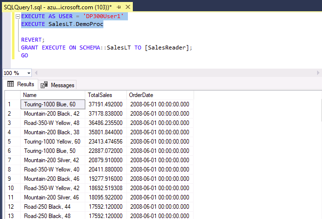

---
lab:
  title: "Labo\_3\_: Autoriser l’accès à Azure SQL Database avec Azure Active Directory"
  module: Implement a Secure Environment for a Database Service
---

# Configurer l’authentification et l’autorisation des bases de données

**Durée estimée** : 20 minutes

Les participants utiliseront les informations acquises dans les leçons pour configurer puis mettre en œuvre la sécurité dans le Portail Azure et dans la base de données *AdventureWorks*.

Vous avez été embauché en tant qu’administrateur de base de données senior dans le but de sécuriser l’environnement de base de données.

**Remarque :** ces exercices vous demandent de copier et coller du code T-SQL. Vérifiez que le code a été copié correctement, avant de l’exécuter.

## Autoriser l’accès à Azure SQL Database avec Azure Active Directory

1. Depuis la machine virtuelle du labo, démarrez une session de navigateur et naviguez vers [https://portal.azure.com](https://portal.azure.com/). Connectez-vous au portail à l’aide du **nom d’utilisateur** et du **mot de passe** Azure fournis dans l’onglet **Ressources** de cette machine virtuelle de labo.

    

1. Dans la page d’accueil du portail Azure, sélectionnez **Toutes les ressources**.

    

1. Sélectionnez le serveur Azure SQL Database **dp300-lab-xxxxxx**, où **xxxxxx** est une chaîne aléatoire, puis sélectionnez **Non configuré** à côté de **Administrateur Active Directory**.

    

1. Dans l’écran suivant, sélectionnez **Définir l’administrateur**.

    

1. Dans la barre latérale **Azure Active Directory**, recherchez le nom d’utilisateur Azure avec lequel vous vous êtes connecté au Portail Azure, puis cliquez sur **Sélectionner**.

1. Sélectionnez **Enregistrer** pour terminer la procédure. Votre nom d’utilisateur devient l’administrateur Azure Active Directory du serveur, comme montré ci-dessous.

    

1. Sur la gauche, sélectionnez **Vue d’ensemble**, puis copiez le **nom du serveur**.

    

1. Ouvrez SQL Server Management Studio et sélectionnez **Se connecter** > **Moteur de base de données**. Dans **Nom du serveur**, collez le nom de votre serveur. Remplacez le type d’authentification par **Azure Active Directory universel avec MFA**.

    

    Pour le champ **Nom d’utilisateur**, sélectionnez le **Nom d’utilisateur** Azure sous l’onglet **Ressources**.

1. Cliquez sur **Se connecter**.

> [!NOTE]
> Lorsque vous tentez de vous connecter pour la première fois à une base de données Azure SQL, l’adresse IP de votre client doit être ajoutée au pare-feu. SQL Server Management Studio peut le faire pour vous. Utilisez le **mot de passe** du portail Azure sous l’onglet **Ressources**, sélectionnez **Se connecter**, choisissez vos informations d’identification Azure, puis sélectionnez **OK**.
> 

## Gérer l’accès aux objets de base de données

Dans cette tâche, vous allez gérer l’accès à la base de données et à ses objets. La première chose à faire est de créer deux utilisateurs dans la base de données *AdventureWorksLT*.

1. Utilisez l’**Explorateur d’objets** pour développer **Bases de données**.
1. Cliquez avec le bouton droit sur **AdventureWorksLT**, puis sélectionnez **Nouvelle requête**.

    

1. Dans la nouvelle fenêtre de requête, copiez et collez le code T-SQL ci-dessous. Exécutez la requête pour créer les deux utilisateurs.

    ```sql
    CREATE USER [DP300User1] WITH PASSWORD = 'Azur3Pa$$';
    GO

    CREATE USER [DP300User2] WITH PASSWORD = 'Azur3Pa$$';
    GO
    ```

    **Remarque** : notez que ces utilisateurs sont créés dans l’étendue de la base de données AdventureWorksLT. Ensuite, vous allez créer un rôle personnalisé et y ajouter les utilisateurs.

1. Exécutez le code T-SQL suivant dans la même fenêtre de requête.

    ```sql
    CREATE ROLE [SalesReader];
    GO

    ALTER ROLE [SalesReader] ADD MEMBER [DP300User1];
    GO

    ALTER ROLE [SalesReader] ADD MEMBER [DP300User2];
    GO
    ```

    Créez ensuite une procédure stockée dans le schéma **SalesLT**.

1. Exécutez le code T-SQL ci-dessous dans votre fenêtre de requête.

    ```sql
    CREATE OR ALTER PROCEDURE SalesLT.DemoProc
    AS
    SELECT P.Name, Sum(SOD.LineTotal) as TotalSales ,SOH.OrderDate
    FROM SalesLT.Product P
    INNER JOIN SalesLT.SalesOrderDetail SOD on SOD.ProductID = P.ProductID
    INNER JOIN SalesLT.SalesOrderHeader SOH on SOH.SalesOrderID = SOD.SalesOrderID
    GROUP BY P.Name, SOH.OrderDate
    ORDER BY TotalSales DESC
    GO
    ```

    Utilisez ensuite la syntaxe `EXECUTE AS USER` pour tester la sécurité. Cela permet au moteur de base de données d’exécuter une requête dans le contexte de votre utilisateur.

1. Exécutez le code T-SQL suivant.

    ```sql
    EXECUTE AS USER = 'DP300User1'
    EXECUTE SalesLT.DemoProc
    ```

    L’opération va échouer avec le message :

    

1. Ensuite, accordez des autorisations au rôle pour lui permettre d’exécuter la procédure stockée. Exécutez le code T-SQL ci-dessous.

    ```sql
    REVERT;
    GRANT EXECUTE ON SCHEMA::SalesLT TO [SalesReader];
    GO
    ```

    La première commande rétablit le contexte d’exécution sur le propriétaire de la base de données.

1. Réexécutez le code T-SQL précédent.

    ```sql
    EXECUTE AS USER = 'DP300User1'
    EXECUTE SalesLT.DemoProc
    ```

    

Dans cet exercice, vous avez vu comment vous pouvez utiliser Azure Active Directory pour accorder aux informations d’identification Azure l’accès à une instance SQL Server hébergée dans Azure. Vous avez également utilisé l’instruction T-SQL pour créer des utilisateurs de base de données et leur accorder des autorisations pour exécuter les procédures stockées.
