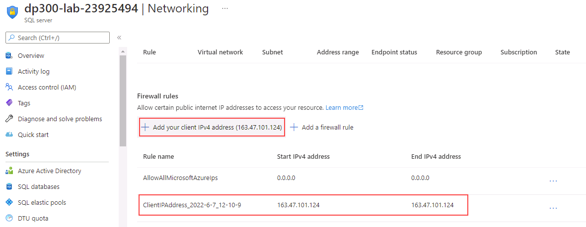
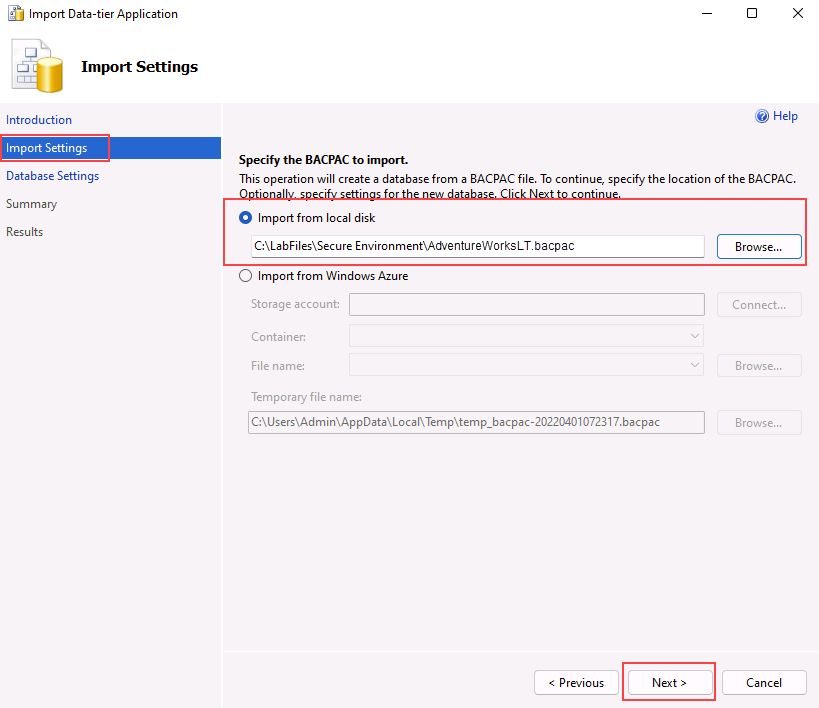
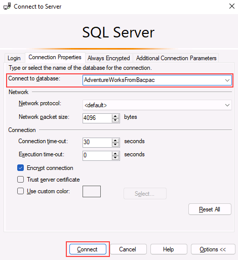

---
lab:
  title: "Lab\_4\_: Configurer des règles de pare-feu Azure SQL Database"
  module: Implement a Secure Environment for a Database Service
---

# Implémenter un environnement sécurisé

**Durée estimée : 30 minutes**

Les participants utiliseront les informations acquises dans les leçons pour configurer puis mettre en œuvre la sécurité dans le Portail Azure et dans la base de données AdventureWorks.

Vous avez été embauché en tant qu’administrateur de base de données senior dans le but de sécuriser l’environnement de base de données. Ces tâches se concentreront sur Azure SQL Database.

**Remarque :** Ces exercices vous demandent de copier et coller du code T-SQL et d’utiliser des ressources SQL existantes. Vérifiez que le code a été copié correctement, avant de l’exécuter.

## Configurer des règles de pare-feu Azure SQL Database

1. Depuis la machine virtuelle du labo, démarrez une session de navigateur et naviguez vers [https://portal.azure.com](https://portal.azure.com/). Connectez-vous au portail à l’aide du **nom d’utilisateur** et du **mot de passe** Azure fournis dans l’onglet **Ressources** de cette machine virtuelle de labo.

    

1. Dans le Portail Azure, recherchez « serveurs SQL » dans le champ de recherche situé en haut de la page, puis cliquez sur **Serveurs SQL** dans la liste des options.

    

1. Sélectionnez le nom du serveur **dp300-lab-XXXXXX** pour accéder à la page détaillée. (Il se peut qu’un groupe de ressources et un emplacement différents aient été affectés à votre serveur SQL).

    

1. Dans l’écran de détails de votre serveur SQL, déplacez votre souris à droite du nom du serveur, puis sélectionnez le bouton **Copier dans le presse-papiers**, comme indiqué ci-dessous.

    

1. Sélectionnez **Afficher les paramètres de mise en réseau**.

    

1. Sur la page **Mise en réseau**, cliquez sur **+ Ajouter votre adresse IPv4 client (votre adresse IP)**, puis sur **Enregistrer**.

    

    **Remarque :** votre adresse IP client a été automatiquement entrée pour vous. L’ajout de votre adresse IP client à la liste vous permettra de vous connecter à votre base de données Azure SQL à l’aide de SQL Server Management Studio ou de tout autre outil client. **Prenez note de votre adresse IP client, vous l’utiliserez plus tard.**

1. Ouvrez SQL Server Management Studio. Dans la boîte de dialogue Se connecter au serveur, collez le nom de votre serveur Azure SQL Database et connectez-vous à l’aide des identifiants de connexion ci-dessous :

    - **Nom du serveur** : &lt;_collez le nom de votre serveur Azure SQL Database ici._&gt;
    - **Authentification :** authentification SQL Server
    - **Identifiant de connexion au serveur de l’administrateur** : labadmin
    - **Mot de passe** : P@ssw0rd01

    

1. Cliquez sur **Connecter**.

1. Dans l’Explorateur d’objets, développez le nœud du serveur, cliquez avec le bouton droit sur **Bases de données**. Cliquez sur **Importer une application de la couche Données**.

    

1. Dans la boîte de dialogue **Importer une application de couche Données**, cliquez sur **Suivant** sur le premier écran.

1. Téléchargez le fichier .bacpac situé sur **https://github.com/MicrosoftLearning/dp-300-database-administrator/blob/master/Instructions/Templates/AdventureWorksLT.bacpac** à l’emplacement **C:\LabFiles\Secure Environment** sur la machine virtuelle du labo (créez la structure du dossier si elle n’existe pas).

1. Sur l’écran **Importer les paramètres**, cliquez sur **Parcourir** et accédez au dossier **C:\LabFiles\Secure Environment** et cliquez sur le fichier **AdventureWorksLT.bacpac**, puis ssur **Ouvrir**. Revenez à l’écran **Importer l’application de la couche Données**, puis cliquez sur **Suivant**.

    

    

1. Dans l’écran **Paramètres de la base de données**, apportez les modifications ci-dessous :

    - **Nom de la base de données** : AdventureWorksFromBacpac
    - **Édition de Microsoft Azure SQL Database** : De base

    

1. Sélectionnez **Suivant**.

1. Sur l’écran **Résumé**, cliquez sur **Terminer**. Une fois l’importation terminée, les résultats ci-dessous s’affichent. Cliquez sur **Fermer**.

    

1. Revenez à SQL Server Management Studio, dans l’**Explorateur d’objets**, et développez le dossier **Bases de données**. Cliquez ensuite avec le bouton droit de la souris sur la base de données **AdventureWorksFromBacpac**, puis sur **Nouvelle requête**.

    

1. Exécutez la requête T-SQL suivante en collant le texte dans votre fenêtre de requête.
    1. **Important :** remplacez **000.000.000.00** par votre adresse IP client. Cliquez sur **Exécuter** ou appuyez sur **F5**.

    ```sql
    EXECUTE sp_set_database_firewall_rule 
            @name = N'AWFirewallRule',
            @start_ip_address = '000.000.000.00', 
            @end_ip_address = '000.000.000.00'
    ```

1. Ensuite, vous allez créer un utilisateur contenu dans la base de données **AdventureWorksFromBacpac**. Cliquez sur **Nouvelle requête** et exécutez le code T-SQL suivant.

    ```sql
    USE [AdventureWorksFromBacpac]
    GO
    CREATE USER ContainedDemo WITH PASSWORD = 'P@ssw0rd01'
    ```

    

    **Remarque :** cette commande crée un utilisateur contenu dans la base de données **AdventureWorksFromBacpac**. Nous allons tester ces informations d’identification à l’étape suivante.

1. Naviguez jusqu’à l’**Explorateur d’objets**. Cliquez sur **Connecter**, puis sur **Moteur de base de données**.

    

1. Essayez de vous connecter avec les informations d’identification que vous avez créées à l’étape précédente. Vous devez utiliser les informations suivantes :

    - **Identifiant de connexion** : ContainedDemo
    - **Mot de passe** : P@ssw0rd01

     Cliquez sur **Connecter**.

     Vous recevez l’erreur suivante.

    

    **Remarque** : cette erreur se produit parce que la connexion a tenté de se connecter à la base de données *principale* et non à **AdventureWorksFromBacpac** où l’utilisateur a été créé. Modifiez le contexte de connexion en cliquant sur **OK** pour quitter le message d’erreur, puis en cliquant sur **Options >>** dans la boîte de dialogue **Se connecter au serveur**, comme indiqué ci-dessous.

    

1. Dans l’onglet **Propriétés de la connexion**, saisissez le nom de la base de données **AdventureWorksFromBacpac**, puis cliquez sur **Connecter**.

    

1. Remarquez que vous avez réussi à vous authentifier en utilisant l’utilisateur **ContainedDemo**. Cette fois, vous êtes directement connecté à **AdventureWorksFromBacpac**, qui est la seule base de données à laquelle le nouvel utilisateur a accès.

    

Dans cet exercice, vous avez configuré des règles de pare-feu pour le serveur et la base de données afin d’accéder à une base de données hébergée sur Azure SQL Database. Vous avez également utilisé des instructions T-SQL pour créer un utilisateur contenu et utilisé SQL Server Management Studio pour vérifier l’accès.
