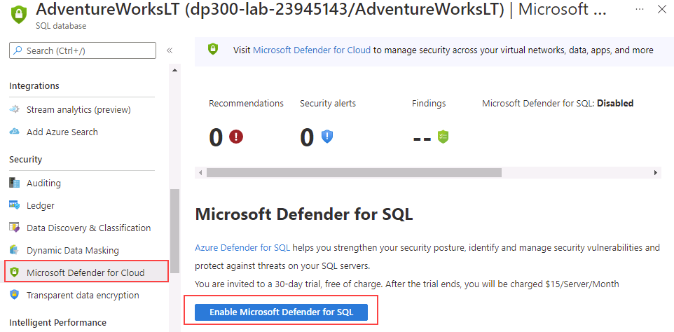
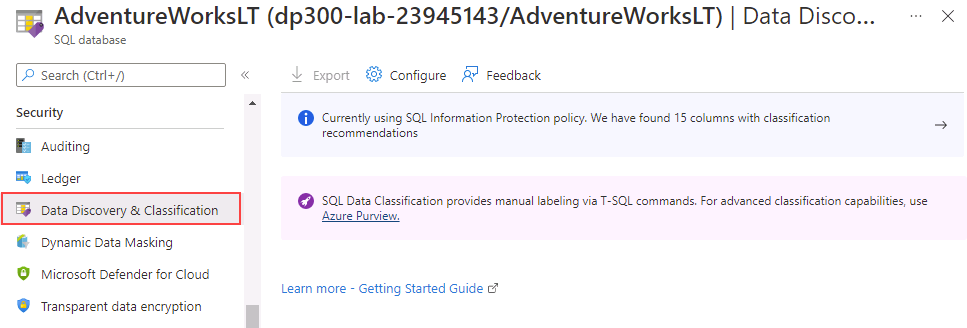

---
lab:
  title: "Labo\_5\_: Activer Microsoft Defender pour SQL et la classification des données"
  module: Implement a Secure Environment for a Database Service
---

# Activer Microsoft Defender pour SQL et la classification des données

**Durée estimée** : 20 minutes

Les participants utiliseront les informations acquises dans les leçons pour configurer puis mettre en œuvre la sécurité dans le Portail Azure et dans la base de données AdventureWorks.

Vous avez été embauché en tant qu’administrateur de base de données senior dans le but de sécuriser l’environnement de base de données. Ces tâches se concentreront sur Azure SQL Database.

**Remarque :** Ces exercices vous demandent de copier et coller du code T-SQL et d’utiliser des ressources SQL existantes. Vérifiez que le code a été copié correctement, avant de l’exécuter.

## Activer Microsoft Defender pour le SQL

1. Depuis la machine virtuelle du labo, démarrez une session de navigateur et naviguez vers [https://portal.azure.com](https://portal.azure.com/). Connectez-vous au portail à l’aide du **nom d’utilisateur** et du **mot de passe** Azure fournis dans l’onglet **Ressources** de cette machine virtuelle de labo.

    

1. Dans le Portail Azure, recherchez « serveurs SQL » dans le champ de recherche situé en haut de la page, puis cliquez sur **Serveurs SQL** dans la liste des options.

    

1. Sélectionnez le nom du serveur **dp300-lab-XXXXXX** pour accéder à la page détaillée. (Il se peut qu’un groupe de ressources et un emplacement différents aient été affectés à votre serveur SQL).

    

1. Dans le panneau principal de votre serveur Azure SQL, accédez à la section **Sécurité**, puis sélectionnez **Microsoft Defender pour le coud**.

    

    Sur la page **Microsoft Defender pour le cloud**, sélectionnez **Activer Microsoft Defender pour SQL**.

1. Le message de notification suivant s’affiche après l’activation d’Azure Defender pour SQL.

    

1. Sur la page **Microsoft Defender pour le cloud**, sélectionnez le lien **Configurer**. (Il se peut que vous deviez actualiser la page pour voir cette option).

    

1. Sur la page **Paramètres du serveur**, remarquez que l’interrupteur à bascule sous **MICROSOFT DEFENDER POUR SQL** est sur **ON**.

## Activer la classification des données

1. Depuis le panneau principal de votre serveur Azure SQL, accédez à la section **Paramètres** et sélectionnez **Bases de données SQL**, puis le nom de la base de données.

    

1. Sur le panneau principal de la base de données **AdventureWorksLT**, accédez à la section **Sécurité**, puis sélectionnez **Découverte et classification des données**.

    

1. Sur la page **Découverte et classification des données**, un message d’information indique : **Nous utilisons actuellement la stratégie de protection des données SQL. Nous avons trouvé 15 colonnes avec des recommandations de classification**. Sélectionnez ce lien.

    

1. Dans l’écran suivant **Découverte et classification des données**, cochez la case **Sélectionner tout**, sélectionnez **Accepter les recommandations sélectionnées**, puis sélectionnez **Enregistrer** pour enregistrer les classifications dans la base de données.

    

1. Revenez à l’écran **Découverte et classification des données** et remarquez que quinze colonnes ont été classées dans cinq tables différentes.

    

Dans cet exercice, vous avez renforcé la sécurité d’une base de données Azure SQL en activant Microsoft Defender pour SQL. Vous avez également créé des colonnes classifiées en fonction des recommandations du Portail Azure.
