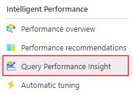

---
lab:
  title: "Labo\_6\_: Isoler les problèmes de performances via la surveillance"
  module: Monitor and optimize operational resources in Azure SQL
---

# Isoler les problèmes de performances via la surveillance

**Durée estimée : 30 minutes**

Les participants utiliseront les informations acquises dans les leçons pour définir les produits livrables d’un projet de transformation numérique au sein d’AdventureWorks. En examinant le Portail Azure ainsi que d’autres outils, les participants détermineront comment utiliser les outils pour identifier et résoudre les problèmes liés aux performances.

Vous avez été embauché en tant qu’administrateur de base de données pour identifier les problèmes liés aux performances et fournir des solutions viables aux problèmes détectés. Vous devez utiliser le portail Azure afin d’identifier les problèmes de performances et de suggérer des méthodes pour les résoudre.

**Remarque :** ces exercices vous demandent de copier et coller du code T-SQL. Vérifiez que le code a été copié correctement, avant de l’exécuter.

## Examiner l’utilisation du processeur dans le portail Azure

1. Depuis la machine virtuelle du labo, démarrez une session de navigateur et naviguez vers [https://portal.azure.com](https://portal.azure.com/). Connectez-vous au portail à l’aide du **nom d’utilisateur** et du **mot de passe** Azure fournis dans l’onglet **Ressources** de cette machine virtuelle de labo.

    

1. Dans le Portail Azure, recherchez « serveurs SQL » dans le champ de recherche situé en haut de la page, puis cliquez sur **Serveurs SQL** dans la liste des options.

    

1. Sélectionnez le nom du serveur **dp300-lab-XXXXXX** pour accéder à la page détaillée. (Il se peut qu’un groupe de ressources et un emplacement différents aient été affectés à votre serveur SQL).

    

1. Depuis le panneau principal de votre serveur Azure SQL, accédez à la section **Paramètres** et sélectionnez **Bases de données SQL**, puis le nom de la base de données.

    

1. Sur la page Vue d’ensemble de votre base de données, sélectionnez **Définir le pare-feu du serveur**.

    

1. Sur la page **Mise en réseau**, sélectionnez **+ Ajouter votre adresse IPv4 client (votre adresse IP)**, puis sélectionnez **Enregistrer**.

    

1. Dans le volet de navigation situé au-dessus de **Mise en réseau**, sélectionnez le lien qui commence par **AdventureWorksLT**.

    

1. Dans le volet de navigation gauche, sélectionnez **Éditeur de requête (préversion)**.

    

    **Remarque** : cette fonctionnalité est en préversion.

1. Dans **Mot de passe**, saisissez **P@ssw0rd01**, puis sélectionnez **OK**.

    

1. Dans **Requête 1**, entrez la requête suivante, puis sélectionnez **Exécuter** :

    ```sql
    DECLARE @Counter INT 
    SET @Counter=1
    WHILE ( @Counter <= 10000)
    BEGIN
        SELECT 
             RTRIM(a.Firstname) + ' ' + RTRIM(a.LastName)
            , b.AddressLine1
            , b.AddressLine2
            , RTRIM(b.City) + ', ' + RTRIM(b.StateProvince) + '  ' + RTRIM(b.PostalCode)
            , CountryRegion
            FROM SalesLT.Customer a
            INNER JOIN SalesLT.CustomerAddress c 
                ON a.CustomerID = c.CustomerID
            RIGHT OUTER JOIN SalesLT.Address b
                ON b.AddressID = c.AddressID
        ORDER BY a.LastName ASC
        SET @Counter  = @Counter  + 1
    END
    ```

    

1. Attendez la fin de la requête.

1. Sur le panneau de la base de données **AdventureWorksLT**, sélectionnez l’icône **Mesures** dans la section **Surveillance**.

    

1. Modifiez l’option de menu **Mesure** pour refléter le **Pourcentage du processeur**, puis sélectionnez une **Agrégation** de **Moyenne**. Vous obtiendrez ainsi le pourcentage moyen du processeur pour la période donnée.

    

1. Observez la moyenne du processeur au fil du temps. Vous pouvez obtenir des résultats légèrement différents. Vous pouvez également exécuter la requête plusieurs fois pour obtenir des résultats plus substantiels.

    

## Identifier les requêtes sollicitant beaucoup le processeur

1. Recherchez l’icône **Query Performance Insight** dans la section **Performances intelligentes** du volet de la base de données **AdventureWorksLT**.

    

1. Sélectionnez **Réinitialiser les paramètres**.

    

1. Cliquez sur la requête dans la grille qui est située sous le graphique. Si vous ne voyez pas de requête, attendez 2 minutes, puis sélectionnez **Actualiser**.

    **Remarque :** vous pouvez avoir une durée et un ID de requête différents. Si vous voyez plusieurs requêtes, cliquez sur chacune d’entre elles pour observer les résultats.

    

Pour cette requête, vous pouvez voir que la durée totale est supérieure à une minute et qu’elle a été exécutée environ 10 000 fois.

Dans cet exercice, vous avez appris à explorer les ressources du serveur pour une base de données Azure SQL et à identifier les problèmes potentiels de performances des requêtes grâce à Query Performance Insight.
