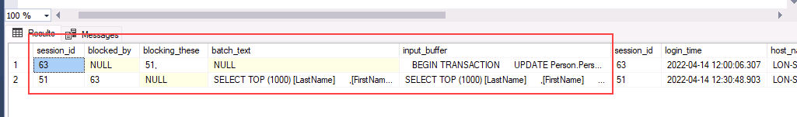
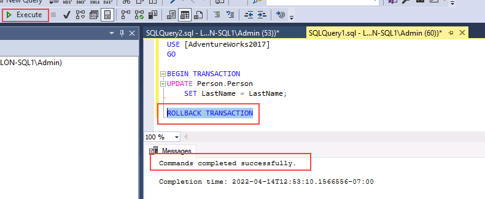

---
lab:
  title: "Labo\_8\_: Identifier et résoudre les problèmes de blocage"
  module: Optimize query performance in Azure SQL
---

# Identifier et résoudre les problèmes de blocage

**Durée estimée** : 15 minutes

Les participants utiliseront les informations acquises dans les leçons pour définir les produits livrables d’un projet de transformation numérique au sein d’AdventureWorks. En examinant le Portail Azure ainsi que d’autres outils, les participants détermineront comment utiliser les outils natifs pour identifier et résoudre les problèmes liés aux performances. Enfin, les participants pourront identifier et résoudre les problèmes de blocage de manière appropriée.

Vous avez été embauché en tant qu’administrateur de base de données pour identifier les problèmes liés aux performances et fournir des solutions viables aux problèmes détectés. Vous devez étudier les problèmes de performance et proposer des méthodes pour les résoudre.

**Remarque :** ces exercices vous demandent de copier et coller du code T-SQL. Vérifiez que le code a été copié correctement, avant de l’exécuter.

## Restaurer une base de données

1. Téléchargez le fichier de sauvegarde de la base de données situé sur **https://github.com/MicrosoftLearning/dp-300-database-administrator/blob/master/Instructions/Templates/AdventureWorks2017.bak** à l’emplacement **C:\LabFiles\Monitor and optimize** sur la machine virtuelle du labo (créez la structure du dossier si elle n’existe pas).

    

1. Sélectionnez le bouton Démarrer de Windows et tapez SSMS. Sélectionnez **Microsoft SQL Server Management Studio 18** dans la liste.  

    

1. Lorsque SSMS s’ouvre, remarquez que la boîte de dialogue **Se connecter au serveur** est préremplie avec le nom de l’instance par défaut. Sélectionnez **Connecter**.

    

1. Sélectionnez le dossier **Bases de données**, puis **Nouvelle requête**.

    

1. Dans la nouvelle fenêtre de requête, copiez et collez le code T-SQL ci-dessous. Exécutez la requête pour restaurer la base de données.

    ```sql
    RESTORE DATABASE AdventureWorks2017
    FROM DISK = 'C:\LabFiles\Monitor and optimize\AdventureWorks2017.bak'
    WITH RECOVERY,
          MOVE 'AdventureWorks2017' 
            TO 'C:\LabFiles\Monitor and optimize\AdventureWorks2017.mdf',
          MOVE 'AdventureWorks2017_log'
            TO 'C:\LabFiles\Monitor and optimize\AdventureWorks2017_log.ldf';
    ```

    **Remarque** : le nom et le chemin du fichier de sauvegarde de la base de données doivent correspondre à ceux que vous avez téléchargés à l’étape 1, sinon la commande échouera.

1. Vous devriez voir un message de réussite une fois la restauration terminée.

    

## Exécuter le rapport des requêtes bloquées

1. Sélectionnez **Nouvelle requête**. Copiez et collez le code T-SQL suivant dans la fenêtre de l’éditeur. Sélectionnez **Exécuter** pour exécuter cette requête.

    ```sql
    USE MASTER

    GO

    CREATE EVENT SESSION [Blocking] ON SERVER 
    ADD EVENT sqlserver.blocked_process_report(
    ACTION(sqlserver.client_app_name,sqlserver.client_hostname,sqlserver.database_id,sqlserver.database_name,sqlserver.nt_username,sqlserver.session_id,sqlserver.sql_text,sqlserver.username))
    ADD TARGET package0.ring_buffer
    WITH (MAX_MEMORY=4096 KB, EVENT_RETENTION_MODE=ALLOW_SINGLE_EVENT_LOSS, MAX_DISPATCH_LATENCY=30 SECONDS, MAX_EVENT_SIZE=0 KB,MEMORY_PARTITION_MODE=NONE, TRACK_CAUSALITY=OFF,STARTUP_STATE=ON)
    GO

    -- Start the event session 
    ALTER EVENT SESSION [Blocking] ON SERVER 
    STATE = start; 
    GO
    ```

    Le code T-SQL ci-dessus crée une session d’événements étendus qui capture les événements de blocage. Les données peuvent contenir les éléments suivants :

    - Nom de l’application cliente
    - Nom d’hôte du client
    - ID de base de données
    - Nom de la base de données
    - Nom d’utilisateur NT
    - ID session
    - Texte T-SQL
    - Nom d’utilisateur

1. Sélectionnez **Nouvelle requête**. Copiez et collez le code T-SQL suivant dans la fenêtre de l’éditeur. Sélectionnez **Exécuter** pour exécuter cette requête.

    ```sql
    EXEC sys.sp_configure N'show advanced options', 1
    RECONFIGURE WITH OVERRIDE;
    GO
    EXEC sp_configure 'blocked process threshold (s)', 60
    RECONFIGURE WITH OVERRIDE;
    GO
    ```

    **Remarque** : la commande ci-dessus spécifie le seuil, en secondes, à partir duquel des rapports sur les processus bloqués sont générés. Par conséquent, nous ne sommes pas obligés dans cette leçon d’attendre aussi longtemps que le rapport *blocked_process_report* soit établi.

1. Sélectionnez **Nouvelle requête**. Copiez et collez le code T-SQL suivant dans la fenêtre de l’éditeur. Sélectionnez **Exécuter** pour exécuter cette requête.

    ```sql
    USE AdventureWorks2017
    GO

    BEGIN TRANSACTION
        UPDATE Person.Person 
        SET LastName = LastName;

    GO
    ```

1. Ouvrez une autre fenêtre de requête en sélectionnant le bouton **Nouvelle requête**. Copiez et collez le code T-SQL suivant dans la nouvelle fenêtre de requête. Sélectionnez **Exécuter** pour exécuter cette requête.

    ```sql
    USE AdventureWorks2017
    GO

    SELECT TOP (1000) [LastName]
      ,[FirstName]
      ,[Title]
    FROM Person.Person
    WHERE FirstName = 'David'
    ```

    **Remarque :** cette requête ne renvoie aucun résultat et semble s’exécuter indéfiniment.

1. Dans l’**Explorateur d’objets**, développez **Gestion** -> **Événements étendus** -> **Sessions**.

    Remarquez que l’événement étendu nommé *Blocage* que nous venons de créer figure dans la liste.

    

1. Cliquez avec le bouton droit sur **package0.ring_buffer**, puis sélectionnez **Afficher les données cibles**.

    

1. Sélectionnez le lien hypertexte.

    

1. Le code XML vous montre les processus bloqués et le processus à l’origine du blocage. Vous pouvez voir les requêtes qui ont été exécutées dans ce processus, ainsi que les informations système.

    

1. Vous pouvez également exécuter la requête ci-dessous pour identifier les sessions qui bloquent d’autres sessions, y compris une liste des identifiants de session bloqués par *session_id*.

    ```sql
    WITH cteBL (session_id, blocking_these) AS 
    (SELECT s.session_id, blocking_these = x.blocking_these FROM sys.dm_exec_sessions s 
    CROSS APPLY    (SELECT isnull(convert(varchar(6), er.session_id),'') + ', '  
                    FROM sys.dm_exec_requests as er
                    WHERE er.blocking_session_id = isnull(s.session_id ,0)
                    AND er.blocking_session_id <> 0
                    FOR XML PATH('') ) AS x (blocking_these)
    )
    SELECT s.session_id, blocked_by = r.blocking_session_id, bl.blocking_these
    , batch_text = t.text, input_buffer = ib.event_info, * 
    FROM sys.dm_exec_sessions s 
    LEFT OUTER JOIN sys.dm_exec_requests r on r.session_id = s.session_id
    INNER JOIN cteBL as bl on s.session_id = bl.session_id
    OUTER APPLY sys.dm_exec_sql_text (r.sql_handle) t
    OUTER APPLY sys.dm_exec_input_buffer(s.session_id, NULL) AS ib
    WHERE blocking_these is not null or r.blocking_session_id > 0
    ORDER BY len(bl.blocking_these) desc, r.blocking_session_id desc, r.session_id;
    ```

    

1. Cliquez avec le bouton droit sur l’événement étendu nommé **Blocage**, puis sélectionnez **Arrêter la session**.

    

1. Revenez à la session de requête à l’origine du blocage et saisissez `ROLLBACK TRANSACTION` sur la ligne sous la requête. Mettez en surbrillance `ROLLBACK TRANSACTION`, puis sélectionnez **Exécuter**.

    

1. Revenez à la session de requête qui était bloquée. Notez que la requête est maintenant terminée.

    

## Activer le niveau d’isolement de capture instantanée Lire la validation

1. Sélectionnez **Nouvelle requête** dans SQL Server Management Studio. Copiez et collez le code T-SQL suivant dans la fenêtre de l’éditeur. Sélectionnez le bouton **Exécuter** pour exécuter cette requête.

    ```sql
    USE master
    GO
    
    ALTER DATABASE AdventureWorks2017 SET READ_COMMITTED_SNAPSHOT ON WITH ROLLBACK IMMEDIATE;
    GO
    ```

1. Réexécutez la requête à l’origine du blocage dans un nouvel éditeur de requêtes.

    ```sql
    USE AdventureWorks2017
    GO
    
    BEGIN TRANSACTION
        UPDATE Person.Person 
        SET LastName = LastName;
    GO
    ```

1. Réexécutez la requête qui était bloquée dans un nouvel éditeur de requêtes.

    ```sql
    USE AdventureWorks2017
    GO
    
    SELECT TOP (1000) [LastName]
     ,[FirstName]
     ,[Title]
    FROM Person.Person
    WHERE firstname = 'David'
    ```

    

    Pourquoi la même requête aboutit-elle alors que dans la tâche précédente elle était bloquée par l’instruction de mise à jour ?

    Le niveau d’isolation Capture instantanée Read Committed est une forme optimiste de l’isolation des transactions. Ainsi, la dernière requête montre la dernière version validée des données au lieu d’une requête bloquée.

Dans cet exercice, vous avez appris à identifier les sessions bloquées et à atténuer ces scénarios.
