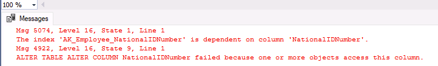

---
lab:
  title: "Labo\_9\_: Identifier les problèmes de conception de base de données"
  module: Optimize query performance in Azure SQL
---

# Identifier les problèmes de conception de base de données

**Durée estimée** : 15 minutes

Les participants utiliseront les informations acquises dans les leçons pour définir les produits livrables d’un projet de transformation numérique au sein d’AdventureWorks. En examinant le Portail Azure ainsi que d’autres outils, les participants détermineront comment utiliser les outils natifs pour identifier et résoudre les problèmes liés aux performances. Enfin, les participants seront en mesure d’évaluer la conception d’une base de données pour résoudre les problèmes liés à la normalisation, à la sélection des types de données et à la conception des index.

Vous avez été embauché en tant qu’administrateur de base de données pour identifier les problèmes liés aux performances et fournir des solutions viables aux problèmes détectés. AdventureWorks vend des vélos et des pièces de vélos directement aux consommateurs et aux distributeurs depuis plus de dix ans. Votre tâche consiste à identifier les problèmes de performances des requêtes et à les résoudre à l’aide des techniques apprises dans ce module.

**Remarque :** ces exercices vous demandent de copier et coller du code T-SQL. Vérifiez que le code a été copié correctement, avant de l’exécuter.

## Restaurer une base de données

1. Téléchargez le fichier de sauvegarde de la base de données situé sur **https://github.com/MicrosoftLearning/dp-300-database-administrator/blob/master/Instructions/Templates/AdventureWorks2017.bak** à l’emplacement **C:\LabFiles\Monitor and optimize** sur la machine virtuelle du labo (créez la structure du dossier si elle n’existe pas).

    

1. Sélectionnez le bouton Démarrer de Windows et tapez SSMS. Sélectionnez **Microsoft SQL Server Management Studio 18** dans la liste.  

    

1. Lorsque SSMS s’ouvre, remarquez que la boîte de dialogue **Se connecter au serveur** est préremplie avec le nom de l’instance par défaut. Cliquez sur **Se connecter**.

    

1. Sélectionnez le dossier **Bases de données**, puis **Nouvelle requête**.

    

1. Dans la nouvelle fenêtre de requête, copiez et collez le code T-SQL ci-dessous. Exécutez la requête pour restaurer la base de données.

    ```sql
    RESTORE DATABASE AdventureWorks2017
    FROM DISK = 'C:\LabFiles\Monitor and optimize\AdventureWorks2017.bak'
    WITH RECOVERY,
          MOVE 'AdventureWorks2017' 
            TO 'C:\LabFiles\Monitor and optimize\AdventureWorks2017.mdf',
          MOVE 'AdventureWorks2017_log'
            TO 'C:\LabFiles\Monitor and optimize\AdventureWorks2017_log.ldf';
    ```

    **Remarque** : le nom et le chemin du fichier de sauvegarde de la base de données doivent correspondre à ceux que vous avez téléchargés à l’étape 1, sinon la commande échouera.

1. Vous devriez voir un message de réussite une fois la restauration terminée.

    

## Examiner la requête et identifier le problème

1. Sélectionnez **Nouvelle requête**. Copiez et collez le code T-SQL suivant dans la fenêtre de l’éditeur. Sélectionnez **Exécuter** pour exécuter cette requête.

    ```sql
    USE AdventureWorks2017
    GO
    
    SELECT BusinessEntityID, NationalIDNumber, LoginID, HireDate, JobTitle
    FROM HumanResources.Employee
    WHERE NationalIDNumber = 14417807;
    ```

1. Sélectionnez l’icône **Inclure le plan d’exécution réel** comme indiqué ci-dessous avant d’exécuter la requête, ou appuyez sur **CTRL+M**. Cela entraîne l’affichage du plan d’exécution lorsque vous exécutez la requête. Sélectionnez **Exécuter** pour exécuter cette requête.

    

1. Accédez au plan d’exécution en sélectionnant l’onglet **Plan d’exécution** dans le volet de résultats. Dans le plan d’exécution, placez le pointeur de la souris sur l’opérateur `SELECT`. Vous verrez un message d’avertissement avec un point d’exclamation dans un triangle jaune, comme indiqué ci-dessous. Lisez le message d’avertissement pour comprendre ce qui se passe.

    

## Identifier les moyens de corriger le message d’avertissement

La structure de la table *[HumanResources].[Employee]* est indiquée dans l’instruction DDL suivante. Passez en revue les champs utilisés dans la requête SQL précédente et comparez-les à l’instruction DDL, en faisant attention à leurs types.

```sql
CREATE TABLE [HumanResources].[Employee](
     [BusinessEntityID] [int] NOT NULL,
     [NationalIDNumber] [nvarchar](15) NOT NULL,
     [LoginID] [nvarchar](256) NOT NULL,
     [OrganizationNode] [hierarchyid] NULL,
     [OrganizationLevel] AS ([OrganizationNode].[GetLevel]()),
     [JobTitle] [nvarchar](50) NOT NULL,
     [BirthDate] [date] NOT NULL,
     [MaritalStatus] [nchar](1) NOT NULL,
     [Gender] [nchar](1) NOT NULL,
     [HireDate] [date] NOT NULL,
     [SalariedFlag] [dbo].[Flag] NOT NULL,
     [VacationHours] [smallint] NOT NULL,
     [SickLeaveHours] [smallint] NOT NULL,
     [CurrentFlag] [dbo].[Flag] NOT NULL,
     [rowguid] [uniqueidentifier] ROWGUIDCOL NOT NULL,
     [ModifiedDate] [datetime] NOT NULL
) ON [PRIMARY]
```

1. D’après le message d’avertissement présenté dans le plan d’exécution, quelle modification recommanderiez-vous ?

    1. Identifiez le champ qui provoque la conversion implicite et cherchez à savoir pourquoi. 
    1. Si vous examinez la requête :

        ```sql
        SELECT BusinessEntityID, NationalIDNumber, LoginID, HireDate, JobTitle
        FROM HumanResources.Employee
        WHERE NationalIDNumber = 14417807;
        ```

        Vous verrez que la valeur comparée à la colonne *NationalIDNumber* de la clause `WHERE` est comparée à un nombre, car **14417807** ne figure pas dans une chaîne entre guillemets. 

        Après avoir examiné la structure de la table, vous verrez que la colonne *NationalIDNumber* utilise le type de données `NVARCHAR` et non le type de données `INT`. Cette incohérence fait que la base de données convertit implicitement le nombre en une valeur `NVARCHAR`, ce qui crée un plan non optimal et entraîne de mauvaises performances des requêtes.

Il existe deux approches que nous pouvons implémenter pour corriger l’avertissement de conversion implicite. Nous examinerons chacune d’entre elles dans les étapes suivantes.

### Modifier le code

1. Comment modifieriez-vous le code pour résoudre la conversion implicite ? Modifiez le code et réexécutez la requête.

    N’oubliez pas d’activer l’option **Inclure le plan d’exécution réel** (**CTRL+M**) si ce n’est pas déjà fait. 

    Dans ce scénario, il suffit d’ajouter un guillemet simple de chaque côté de la valeur pour que celle-ci passe d’un nombre à un caractère. Laissez la fenêtre de requête ouverte pour cette requête.

    Exécutez la requête SQL mise à jour :

    ```sql
    SELECT BusinessEntityID, NationalIDNumber, LoginID, HireDate, JobTitle
    FROM HumanResources.Employee
    WHERE NationalIDNumber = '14417807';
    ```

    

    **Remarque** : le message d’avertissement est désormais supprimé et que le plan de requête s’est amélioré. Si vous modifiez la clause `WHERE` afin que la valeur comparée à la colonne *NationalIDNumber* corresponde au type de données de la colonne dans la table, l’optimiseur peut se débarrasser de la conversion implicite.

### Changer le type de données

1. Nous pouvons également corriger l’avertissement de conversion implicite en modifiant la structure de la table.

    Pour corriger l’index, copiez-collez la requête ci-dessous dans une nouvelle fenêtre de requête afin de modifier le type de données de la colonne. Tentez d’exécuter la requête en sélectionnant **Exécuter** ou en appuyant sur <kbd>F5</kbd>.

    ```sql
    ALTER TABLE [HumanResources].[Employee] ALTER COLUMN [NationalIDNumber] INT NOT NULL;
    ```

    La modification du type de données de la colonne *NationalIDNumber* en INT résout le problème de conversion. Toutefois, cette modification introduit un autre problème que vous devez résoudre en tant qu’administrateur de base de données.

    

    La colonne *NationalIDNumber* fait partie d’un index non-cluster existant, l’index doit être reconstruit (recréé) pour que le type de données soit modifié. **Ceci peut entraîner un temps d’arrêt assez long en production, ce qui montre bien l’importance de bien choisir les types de données dans votre conception.**

1. Pour résoudre ce problème, copiez-collez le code ci-dessous dans votre fenêtre de requête et exécutez-le en sélectionnant **Exécuter**.

    ```sql
    USE AdventureWorks2017
    GO
    
    --Dropping the index first
    DROP INDEX [AK_Employee_NationalIDNumber] ON [HumanResources].[Employee]
    GO

    --Changing the column data type to resolve the implicit conversion warning
    ALTER TABLE [HumanResources].[Employee] ALTER COLUMN [NationalIDNumber] INT NOT NULL;
    GO

    --Recreating the index
    CREATE UNIQUE NONCLUSTERED INDEX [AK_Employee_NationalIDNumber] ON [HumanResources].[Employee]( [NationalIDNumber] ASC );
    GO
    ```

1. Vous pouvez également exécuter la requête ci-dessous pour vérifier que le type de données a été correctement modifié.

    ```sql
    SELECT c.name, t.name
    FROM sys.all_columns c INNER JOIN sys.types t
        ON (c.system_type_id = t.user_type_id)
    WHERE OBJECT_ID('[HumanResources].[Employee]') = c.object_id
        AND c.name = 'NationalIDNumber'
    ```
    
    
    
1. Nous allons maintenant vérifier le plan d’exécution. Réexécutez la requête d’origine sans les guillemets.

    ```sql
    USE AdventureWorks2017
    GO

    SELECT BusinessEntityID, NationalIDNumber, LoginID, HireDate, JobTitle
    FROM HumanResources.Employee
    WHERE NationalIDNumber = 14417807;
    ```

    

    Examinez le plan de requête et remarquez que vous pouvez désormais utiliser un entier pour filtrer par *NationalIDNumber* sans l’avertissement de conversion implicite. L’optimiseur de requête SQL peut désormais générer et exécuter le plan le plus optimal.

Dans cet exercice, vous avez appris à identifier les problèmes de requête causés par des conversions implicites de types de données et à les résoudre pour améliorer le plan de requête.
