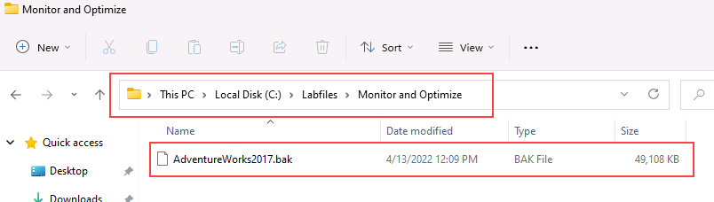
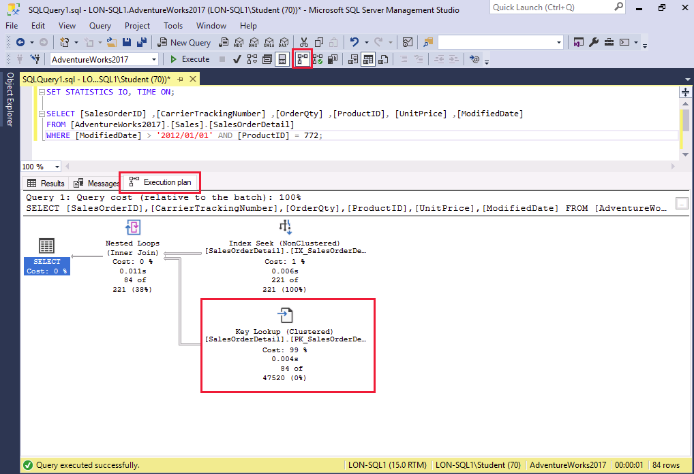
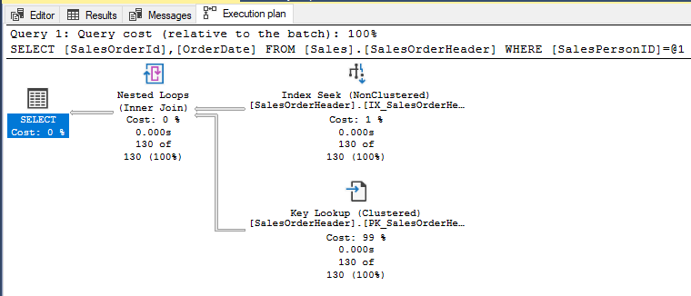

---
lab:
  title: "Labo\_10\_: Isoler les zones à problème des requêtes peu performantes dans SQL Database"
  module: Optimize query performance in Azure SQL
---

# Isoler les zones à problème des requêtes peu performantes dans SQL Database

**Durée estimée : 30 minutes**

Vous avez été embauché en tant qu’administrateur de base de données senior pour résoudre les problèmes de performances qui ont lieu lorsque les utilisateurs interrogent la base de données *AdventureWorks2017*. Votre tâche consiste à identifier les problèmes de performances des requêtes et à les résoudre à l’aide des techniques apprises dans ce module.

Vous allez exécuter des requêtes qui ont des performances non optimales, examiner les plans de requête et tenter d’apporter des améliorations dans la base de données.

**Remarque :** ces exercices vous demandent de copier et coller du code T-SQL. Vérifiez que le code a été copié correctement, avant de l’exécuter.

## Restaurer une base de données

1. Téléchargez le fichier de sauvegarde de la base de données situé sur **https://github.com/MicrosoftLearning/dp-300-database-administrator/blob/master/Instructions/Templates/AdventureWorks2017.bak** à l’emplacement **C:\LabFiles\Monitor and optimize** sur la machine virtuelle du labo (créez la structure du dossier si elle n’existe pas).

    

1. Sélectionnez le bouton Démarrer de Windows et tapez SSMS. Sélectionnez **Microsoft SQL Server Management Studio 18** dans la liste.  

    

1. Lorsque SSMS s’ouvre, remarquez que la boîte de dialogue **Se connecter au serveur** est préremplie avec le nom de l’instance par défaut. Sélectionnez **Connecter**.

    

1. Sélectionnez le dossier **Bases de données**, puis **Nouvelle requête**.

    

1. Dans la nouvelle fenêtre de requête, copiez et collez le code T-SQL ci-dessous. Exécutez la requête pour restaurer la base de données.

    ```sql
    RESTORE DATABASE AdventureWorks2017
    FROM DISK = 'C:\LabFiles\Monitor and optimize\AdventureWorks2017.bak'
    WITH RECOVERY,
          MOVE 'AdventureWorks2017' 
            TO 'C:\LabFiles\Monitor and optimize\AdventureWorks2017.mdf',
          MOVE 'AdventureWorks2017_log'
            TO 'C:\LabFiles\Monitor and optimize\AdventureWorks2017_log.ldf';
    ```

    **Remarque** : le nom et le chemin du fichier de sauvegarde de la base de données doivent correspondre à ceux que vous avez téléchargés à l’étape 1, sinon la commande échouera.

1. Vous devriez voir un message de réussite une fois la restauration terminée.

    

## Générer un vrai plan d’exécution

Il existe plusieurs façons de générer un plan d’exécution dans SQL Server Management Studio.

1. Sélectionnez **Nouvelle requête**. Copiez et collez le code T-SQL suivant dans la fenêtre de l’éditeur. Sélectionnez **Exécuter** pour exécuter cette requête.

    **Remarque** : utilisez **SHOWPLAN_ALL** pour afficher une version texte du plan d’exécution d’une requête dans le volet de résultats, plutôt que sous forme graphique dans un onglet séparé.

    ```sql
    USE AdventureWorks2017;
    GO

    SET SHOWPLAN_ALL ON;
    GO

    SELECT BusinessEntityID
    FROM HumanResources.Employee
    WHERE NationalIDNumber = '14417807';
    GO

    SET SHOWPLAN_ALL OFF;
    GO
    ```

    Vous verrez une version texte du plan d’exécution, au lieu des résultats réels de la requête pour l’instruction **SELECT**.

    

1. Prenez un moment pour examiner le texte de la deuxième ligne de la colonne **StmtText** :

    ```console
    |--Index Seek(OBJECT:([AdventureWorks2017].[HumanResources].[Employee].[AK_Employee_NationalIDNumber]), SEEK:([AdventureWorks2017].[HumanResources].[Employee].[NationalIDNumber]=CONVERT_IMPLICIT(nvarchar(4000),[@1],0)) ORDERED FORWARD)
    ```

    Le texte ci-dessus explique que le plan d’exécution utilise une **Recherche d’index** dans la clé **AK_Employee_NationalIDNumber**. Il montre également que le plan d’exécution a eu besoin d’effectuer une étape **CONVERT_IMPLICIT**.

    L’optimiseur de requête a pu localiser un index approprié pour extraire les enregistrements requis.

## Résoudre un plan de requête non optimal

1. Copiez-collez le code ci-dessous dans une nouvelle fenêtre de requête.

    Sélectionnez l’icône **Inclure le plan d’exécution réel** comme indiqué ci-dessous avant d’exécuter la requête, ou appuyez sur <kbd>CTRL</kbd>+<kbd>M</kbd>. Exécutez la requête en sélectionnant **Exécuter** ou appuyez sur <kbd>F5</kbd>. Prenez note du plan d’exécution et des lectures logiques sous l’onglet Messages.

    ```sql
    SET STATISTICS IO, TIME ON;

    SELECT [SalesOrderID] ,[CarrierTrackingNumber] ,[OrderQty] ,[ProductID], [UnitPrice] ,[ModifiedDate]
    FROM [AdventureWorks2017].[Sales].[SalesOrderDetail]
    WHERE [ModifiedDate] > '2012/01/01' AND [ProductID] = 772;
    ```

    

    Lorsque vous examinerez le plan d’exécution, vous remarquerez une **recherche de clé**. Si vous placez le curseur de la souris sur l’icône, vous verrez que les propriétés indiquent que la recherche est effectuée pour chaque ligne extraite par la requête. Vous pouvez voir que le plan d’exécution effectue une opération de **recherche de clé**.

    

    Remarquez les colonnes de la section **Liste de sortie**. Comment amélioreriez-vous cette requête ?

    Pour identifier l’index qui doit être modifié afin de supprimer la recherche de clé, vous devez examiner la recherche d’index située au-dessus de celle-ci. Placez le curseur de la souris sur l’opérateur de recherche d’index pour afficher les propriétés de l’opérateur.

    

1. Vous pouvez supprimer les **recherches de clés** en ajoutant un index de couverture qui inclut tous les champs retournés ou recherchés dans la requête. Dans cet exemple, l’index utilise uniquement la colonne **ProductID**. Corrigez la **recherche de clé**, puis réexécutez la requête pour voir le nouveau plan.

    ```sql
    CREATE NONCLUSTERED INDEX [IX_SalesOrderDetail_ProductID] ON [Sales].[SalesOrderDetail]
    ([ProductID] ASC)
    ```

    Si nous ajoutons les champs **Liste de résultat** à l’index en tant que colonnes incluses, la **recherche de clé** sera supprimée. Étant donné que l’index existe déjà, vous devez soit supprimer l’index (DROP) puis le recréer, soit définir **DROP_EXISTING=ON** de manière à ajouter les colonnes. Notez que la colonne **ProductID** fait déjà partie de l’index et qu’il n’est pas nécessaire de l’ajouter en tant que colonne incluse. Nous pouvons également améliorer les performances de l’index en ajoutant **ModifiedDate**.

    ```sql
    CREATE NONCLUSTERED INDEX [IX_SalesOrderDetail_ProductID]
    ON [Sales].[SalesOrderDetail] ([ProductID],[ModifiedDate])
    INCLUDE ([CarrierTrackingNumber],[OrderQty],[UnitPrice])
    WITH (DROP_EXISTING = on);
    GO
    ```

1. Réexécutez la requête de l’étape 1. Notez les modifications apportées aux lectures logiques et au plan d’exécution. Le plan a seulement besoin d’utiliser l’index non-cluster que nous avons créé.

    

## Utiliser le Magasin des requêtes pour détecter et gérer la régression

Maintenant, vous allez exécuter une charge de travail afin de générer des statistiques de requête pour le magasin des requêtes, examiner le rapport **Principales requêtes consommatrices de ressources** afin de déterminer l’origine des mauvaises performances, et voir comment forcer un meilleur plan d’exécution.

1. Sélectionnez **Nouvelle requête**. Copiez et collez le code T-SQL suivant dans la fenêtre de l’éditeur. Sélectionnez **Exécuter** pour exécuter cette requête.

    Ce script active la fonctionnalité du magasin des requêtes dans la base de données AdventureWorks2017 et configure la base de données avec un niveau de compatibilité de 100.

    ```sql
    USE [master];
    GO

    ALTER DATABASE [AdventureWorks2017] SET QUERY_STORE = ON;
    GO

    ALTER DATABASE [AdventureWorks2017] SET QUERY_STORE (OPERATION_MODE = READ_WRITE);
    GO

    ALTER DATABASE [AdventureWorks2017] SET COMPATIBILITY_LEVEL = 100;
    GO
    ```

    La modification du niveau de compatibilité est un retour en arrière pour la base de données. En effet, cette opération restreint les fonctionnalités que SQL Server peut utiliser, car seules les fonctionnalités de SQL Server 2008 sont disponibles.

1. Téléchargez le script T-SQL situé sur **https://github.com/MicrosoftLearning/dp-300-database-administrator/blob/master/Instructions/Templates/CreateRandomWorkloadGenerator.sql** à l’emplacement **C:\LabFiles\Surveiller et optimiser** sur la machine virtuelle du labo.

1. Téléchargez le script T-SQL situé sur **https://github.com/MicrosoftLearning/dp-300-database-administrator/blob/master/Instructions/Templates/ExecuteRandomWorkload.sql** à l’emplacement **C:\LabFiles\Surveiller et optimiser** sur la machine virtuelle du labo.

1. Sélectionnez **Fichier** > **Ouvrir** > **Fichier** dans SQL Server Management Studio.

1. Accédez au fichier **C:\LabFiles\Monitor and optimize\CreateRandomWorkloadGenerator.sql**.

1. Une fois ouvert dans SQL Server Management Studio, sélectionnez **Exécuter** ou appuyez sur <kbd>F5</kbd> pour exécuter la requête.

1. Dans un nouvel éditeur de requête, ouvrez le fichier **C:\LabFiles\Monitor and optimize\ExecuteRandomWorkload.sql**, puis sélectionnez **Exécuter** ou appuyez sur <kbd>F5</kbd> pour exécuter la requête.

1. Une fois l’exécution terminée, exécutez le script une deuxième fois pour créer une charge supplémentaire sur le serveur. Laissez l’onglet Requête ouvert pour cette requête.

1. Copiez-collez le code ci-dessous dans une nouvelle fenêtre de requête, puis exécutez-le en sélectionnant **Exécuter** ou en appuyant sur <kbd>F5</kbd>. 

    Ce script remplace le mode de compatibilité de la base de données par SQL Server 2019 (**150**). Toutes les fonctionnalités et améliorations apportées depuis SQL Server 2008 seront désormais disponibles pour la base de données.

    ```sql
    USE [master];
    GO

    ALTER DATABASE [AdventureWorks2017] SET COMPATIBILITY_LEVEL = 150;
    GO
    ```

1. Retournez à l’onglet de la requête du fichier **ExecuteRandomWorkload.sql** et exécutez-la à nouveau.

## Examiner le rapport Principales requêtes consommatrices de ressources

1. Pour afficher le nœud Magasin des requêtes, vous devez actualiser la base de données AdventureWorks2017 dans SQL Server Management Studio. Cliquez avec le bouton droit sur le nom de la base de données, puis sélectionnez **Actualiser**. Le nœud Magasin des requêtes s’affiche sous la base de données.

    

1. Développez le nœud **Magasin des requêtes** pour afficher tous les rapports disponibles. Sélectionnez le rapport **Principales requêtes consommatrices de ressources**.

    

1. Le rapport s’ouvre, comme dans la capture d’écran ci-dessous. Sur la droite, sélectionnez la liste déroulante du menu, puis sélectionnez **Configurer**.

    

1. Dans l’écran de configuration, remplacez le filtre pour réduire le nombre minimal de plans de requête à 2 plans. Sélectionnez ensuite **OK**.

    

1. Choisissez la requête dont la durée est la plus longue en sélectionnant la barre située la plus à gauche du graphique à barres, dans la partie supérieure gauche du rapport.

    

    Cela vous montrera le résumé de la requête et du plan pour votre requête de longue durée dans le Magasin des requêtes.

## Forcer un meilleur plan d’exécution

1. Accédez à la section Résumé du plan du rapport, comme indiqué ci-dessous. Vous verrez qu’il y a deux plans d’exécution avec un grand écart de durée.

    

1. Sélectionnez l’ID de plan dont la durée est la plus courte (cela est indiqué par une position basse sur l’axe des ordonnées du graphique) dans la fenêtre située en haut à droite du rapport. Dans le graphique ci-dessus, il s’agit du *PlanID 43*. Sélectionnez l’ID de plan en regard du graphique Résumé du plan (celui-ci doit être mis en évidence comme dans la capture d’écran ci-dessus).

1. Sélectionnez **Forcer le plan** sous le graphique de synthèse. Une fenêtre de confirmation s’affiche, sélectionnez **Oui**.

    

    Une fois le plan forcé, vous verrez que le **plan forcé** est désormais grisé et que le plan dans la fenêtre de résumé du plan contient maintenant une coche indiquant qu’il est forcé.

    Il peut arriver que l’optimiseur de requête ne fasse pas un bon choix quant au plan d’exécution à utiliser. Lorsque cela se produit, vous pouvez forcer SQL Server à utiliser le plan de votre choix si vous savez que celui-ci fonctionne mieux.

## Utiliser les indicateurs de requête pour avoir un impact sur les performances

Exécutez ensuite une charge de travail, modifiez la requête pour utiliser un paramètre, appliquez un indice de requête à la requête et exécutez-la à nouveau.

Avant de poursuivre l’exercice, fermez toutes les fenêtres de requête ouvertes en sélectionnant le menu **Fenêtre**, puis sélectionnez **Fermer tous les documents**. Dans le menu contextuel, sélectionnez **Non**.

1. Sélectionnez **Nouvelle requête**, puis sélectionnez l’icône **Inclure le plan d’exécution réel** avant d’exécuter la requête, ou utilisez <kbd>CTRL</kbd>+<kbd>M</kbd>.

    

1. Exécutez la requête ci-dessous. Notez que le plan d’exécution affiche un opérateur de recherche d’index.

    ```sql
    USE AdventureWorks2017;
    GO

    SELECT SalesOrderId, OrderDate
    FROM Sales.SalesOrderHeader
    WHERE SalesPersonID=288;
    ```

    

1. Dans une nouvelle fenêtre de requête, exécutez la requête suivante. Comparez les deux plans d’exécution.

    ```sql
    USE AdventureWorks2017;
    GO

    SELECT SalesOrderId, OrderDate
    FROM Sales.SalesOrderHeader
    WHERE SalesPersonID=277;
    ```

    La seule différence cette fois-ci est que la valeur SalesPersonID est définie sur 277. Notez l’opération d’analyse d’index cluster dans le plan d’exécution.

    

Comme nous pouvons le voir, selon les statistiques d’index, l’optimiseur de requête a choisi un plan d’exécution différent en raison des différentes valeurs de la clause `WHERE`.

Pourquoi avons-nous des plans différents si nous avons uniquement modifié la valeur *SalesPersonID* ?

Cette requête utilise une constante dans sa clause `WHERE`, l’optimiseur considère chacune de ces requêtes comme étant uniques et génère à chaque fois un plan d’exécution différent.

## Modifier la requête pour utiliser une variable et utiliser un indicateur de requête

1. Modifiez la requête afin d’utiliser une valeur de variable pour SalesPersonID.

1. Utilisez l’instruction T-SQL **DECLARE** pour déclarer <strong>@SalesPersonID</strong>. Cela vous permet de passer une valeur au lieu de coder en dur cette valeur dans la clause **WHERE**. Vous devez vérifier que le type de données de votre variable correspond au type de données de la colonne dans la table cible afin d’éviter une conversion implicite.

    ```sql
    USE AdventureWorks2017;
    GO

    SET STATISTICS IO, TIME ON;

    DECLARE @SalesPersonID INT;

    SELECT @SalesPersonID = 288;

    SELECT SalesOrderId, OrderDate
    FROM Sales.SalesOrderHeader
    WHERE SalesPersonID= @SalesPersonID;
    ```

    Si vous examinez le plan d’exécution, vous verrez qu’il utilise une analyse d’index pour obtenir les résultats. L’optimiseur de requête n’a pas pu effectuer de bonnes optimisations, car il ne peut pas connaître la valeur de la variable locale jusqu’au runtime.

1. Vous pouvez aider l’optimiseur de requête à améliorer vos choix en fournissant un indicateur de requête. Réexécutez la requête ci-dessus avec `OPTION (RECOMPILE)` :

    ```sql
    USE AdventureWorks2017
    GO

    SET STATISTICS IO, TIME ON;

    DECLARE @SalesPersonID INT;

    SELECT @SalesPersonID = 288;

    SELECT SalesOrderId, OrderDate
    FROM Sales.SalesOrderHeader
    WHERE SalesPersonID= @SalesPersonID
    OPTION (RECOMPILE);
    ```

    Notez que l’optimiseur de requête a pu choisir un plan d’exécution plus efficace. L’option `RECOMPILE` force le compilateur de requête à remplacer la variable par sa valeur.

    En comparant les statistiques, vous pouvez voir que le nombre de lectures logiques est **68 %** plus élevé (689 contre 409) pour la requête qui ne contient pas d’indicateur de requête.

Dans cet exercice, vous avez appris à identifier les problèmes de requête et à les résoudre pour améliorer le plan de requête.
