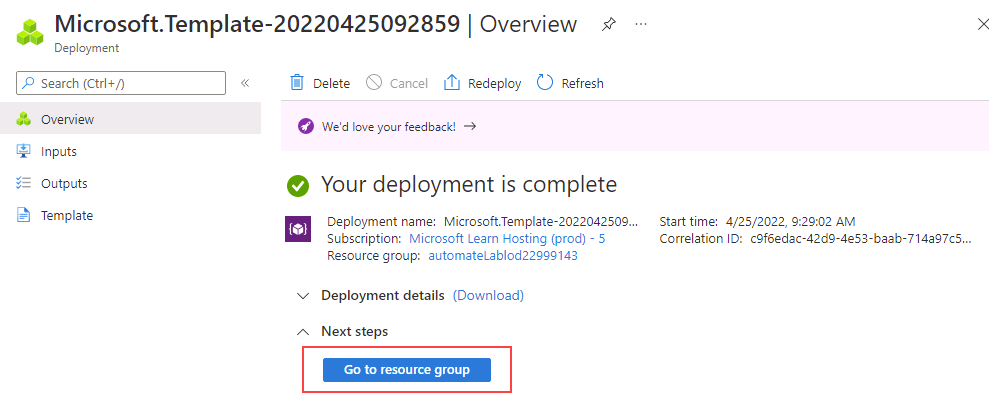

---
lab:
  title: "Labo\_11\_: Déployer Azure SQL Database avec un modèle Azure Resource Manager"
  module: Automate database tasks for Azure SQL
---

# Déployer une base de données Azure SQL à partir d’un modèle

**Durée estimée** : 15 minutes

Vous avez été embauché en tant qu’ingénieur Données senior pour automatiser les opérations d’administration de base de données quotidiennes. Cette automatisation permet de s’assurer que les bases de données pour AdventureWorks continuent de fonctionner à des performances optimales, ainsi que de fournir des méthodes de création d’alertes en fonction de certains critères. AdventureWorks utilise SQL Server à la fois comme infrastructure en tant que service (IaaS) et plateforme en tant que service (PaaS).

## Explorer le modèle Azure Resource Manager

1. Dans Microsoft Edge, ouvrez un nouvel onglet et accédez au chemin suivant dans un dépôt GitHub qui contient un modèle ARM pour déployer une ressource SQL Database.

    ```url
    https://github.com/Azure/azure-quickstart-templates/tree/master/quickstarts/microsoft.sql/sql-database
    ```

1. Cliquez avec le bouton droit sur **azuredeploy.json**, puis sélectionnez **Ouvrir le lien dans un nouvel onglet** pour afficher le modèle ARM, lequel doit ressembler à ceci :

    ```JSON
    {
    "$schema": "https://schema.management.azure.com/schemas/2019-04-01/deploymentTemplate.json#",
    "contentVersion": "1.0.0.0",
    "parameters": {
        "serverName": {
        "type": "string",
        "defaultValue": "[uniqueString('sql', resourceGroup().id)]",
        "metadata": {
            "description": "The name of the SQL logical server."
        }
        },
        "sqlDBName": {
        "type": "string",
        "defaultValue": "SampleDB",
        "metadata": {
            "description": "The name of the SQL Database."
        }
        },
        "location": {
        "type": "string",
        "defaultValue": "[resourceGroup().location]",
        "metadata": {
            "description": "Location for all resources."
        }
        },
        "administratorLogin": {
        "type": "string",
        "metadata": {
            "description": "The administrator username of the SQL logical server."
        }
        },
        "administratorLoginPassword": {
        "type": "securestring",
        "metadata": {
            "description": "The administrator password of the SQL logical server."
        }
        }
    },
    "variables": {},
    "resources": [
        {
        "type": "Microsoft.Sql/servers",
        "apiVersion": "2020-02-02-preview",
        "name": "[parameters('serverName')]",
        "location": "[parameters('location')]",
        "properties": {
            "administratorLogin": "[parameters('administratorLogin')]",
            "administratorLoginPassword": "[parameters('administratorLoginPassword')]"
        },
        "resources": [
            {
            "type": "databases",
            "apiVersion": "2020-08-01-preview",
            "name": "[parameters('sqlDBName')]",
            "location": "[parameters('location')]",
            "sku": {
                "name": "Standard",
                "tier": "Standard"
            },
            "dependsOn": [
                "[resourceId('Microsoft.Sql/servers', concat(parameters('serverName')))]"
            ]
            }
        ]
        }
    ]
    }
    ```

1. Passez en revue et observez les propriétés JSON.

1. Fermez l’onglet **azuredeploy.json** et revenez à l’onglet contenant le dossier GitHub **sql-database**. Faites défiler vers le bas et sélectionnez **Déployer sur Azure**.

    

1. La page du modèle de démarrage rapide **Créer un serveur SQL et une base de données** s’ouvre sur le Portail Azure. Les informations de la ressource sont partiellement remplies à partir du modèle ARM. Complétez les champs vides avec les informations suivantes :

    - **Groupe de ressources** : doit commencer par *contoso-rg*.
    - **Identifiant de connexion de l’administrateur SQL** : labadmin
    - **Mot de passe de connexion de l’administrateur SQL** : &lt;entrez un mot de passe fort.&gt;

1. Sélectionnez **Examiner + créer**, puis sélectionnez **Créer**. Votre déploiement prend environ 5 minutes.

    

1. Une fois le déploiement terminé, sélectionnez **Accéder au groupe de ressources**. Vous êtes dirigé vers votre groupe de ressources Azure qui contient une ressource **SQL Server** nommée de façon aléatoire, créée par le déploiement.

    

---

## Nettoyer les ressources

Si vous n’utilisez pas Azure SQL Server à d’autres fins, vous pouvez nettoyer les ressources que vous avez créées dans ce labo.

### Supprimer le groupe de ressources

Si vous avez créé un groupe de ressources pour ce labo, vous pouvez supprimer le groupe de ressources pour supprimer toutes les ressources créées dans ce labo.

1. Dans le portail Azure, sélectionnez **Groupes de ressources** dans le volet de navigation de gauche ou recherchez les **Groupes de ressources** dans la barre de recherche et sélectionnez-les dans les résultats.

1. Accédez au groupe de ressources que vous avez créé pour ce labo. Le groupe de ressources contient Azure SQL Server et d’autres ressources créées dans ce labo.

1. Sélectionnez **Supprimer le groupe de ressources** dans le menu supérieur.

1. Dans la boîte de dialogue **Supprimer un groupe de ressources**, entrez le nom de votre groupe de ressources pour confirmer, puis sélectionnez **Supprimer**.

1. Attendez que le groupe de ressources soit supprimé.

1. Fermez le portail Azure.

### Supprimez les ressources de labo uniquement.

Si vous n’avez pas créé de groupe de ressources pour ce labo et que vous souhaitez laisser le groupe de ressources et ses ressources précédentes intactes, vous pouvez toujours supprimer les ressources créées dans ce labo.

1. Dans le portail Azure, sélectionnez **Groupes de ressources** dans le volet de navigation de gauche ou recherchez les **Groupes de ressources** dans la barre de recherche et sélectionnez-les dans les résultats.

1. Accédez au groupe de ressources que vous avez créé pour ce labo. Le groupe de ressources contient Azure SQL Server et d’autres ressources créées dans ce labo.

1. Sélectionnez toutes les ressources précédées du nom SQL Server que vous avez spécifié précédemment dans le labo.

1. Sélectionnez **Supprimer** dans le menu en haut.

1. Dans la boîte de dialogue **Supprimer les ressources**, tapez **Supprimer** et sélectionnez **Supprimer**.

1. Pour confirmer la suppression des ressources, sélectionnez **Supprimer**.

1. Attendez que les ressources soient supprimées.

1. Fermez le portail Azure.

---

Vous avez terminé ce labo.

Vous venez de voir comment, en un seul clic sur un lien de modèle Azure Resource Manager, vous pouvez créer un serveur et une base de données Azure SQL en toute simplicité.
