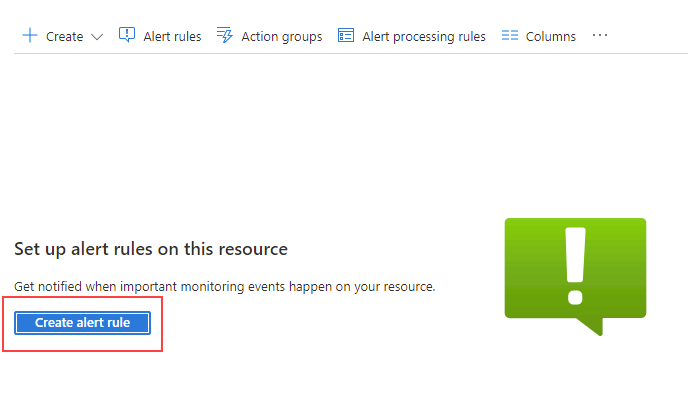
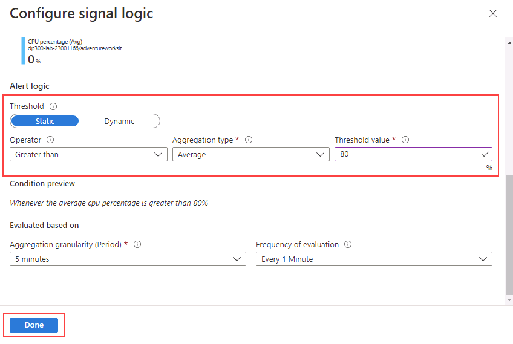
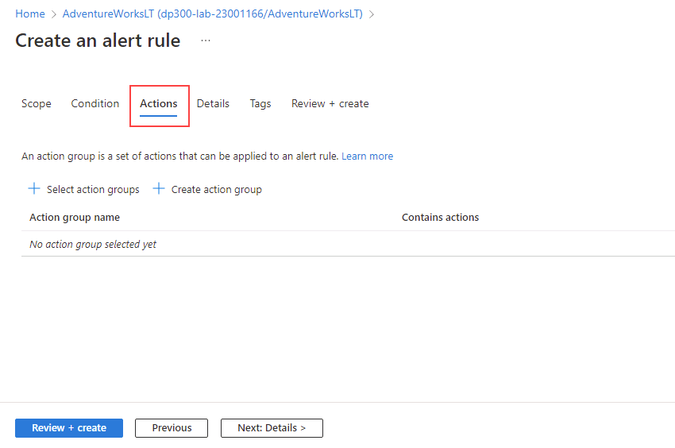
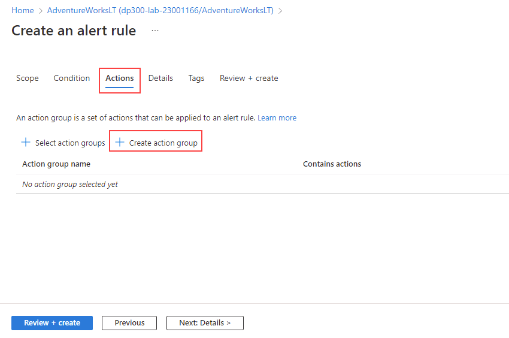
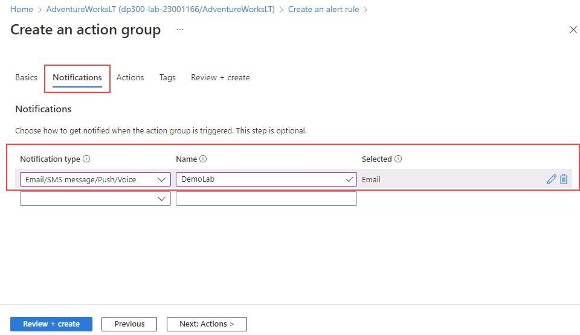

---
lab:
  title: "Labo\_12\_: Créer une alerte sur l’état du processeur pour SQL Server"
  module: Automate database tasks for Azure SQL
---

# Créer une alerte sur l’état du processeur pour SQL Server sur Azure

**Durée estimée : 30 minutes**

Vous avez été embauché en tant qu’ingénieur Données senior pour aider à automatiser les opérations quotidiennes d’administration de base de données. Cette automatisation a pour objectif de s’assurer que les bases de données pour AdventureWorks continuent de fonctionner à des performances optimales, ainsi que de fournir des méthodes pour générer des alertes en fonction de certains critères.

## Créer une alerte quand un processeur dépasse 80 pour cent

1. Dans la barre de recherche en haut du portail Azure, saisissez **SQL** et sélectionnez **bases de données SQL**. Sélectionnez le nom de la base de données **AdventureWorksLT** dans la liste.

    

1. Sur le panneau principal de la base de données **AdventureWorksLT**, naviguez jusqu’à la section de surveillance. Sélectionnez **Alertes**.

    

1. Sélectionnez **Créer une règle d’alerte**.

    

1. Dans la section **Sélectionner un signal**, sélectionnez **Pourcentage du processeur**.

    

1. Dans la section **Configurer le signal**, sélectionnez **Statique** pour la propriété **Seuil**. Vérifiez ensuite que la propriété **Opérateur** est **Supérieur à** et que le **Type d’agrégation** est **Moyen**. Ensuite, dans **valeur de seuil** , entrez la valeur **80**. Cliquez sur **Terminé**.

    

1. Sélectionnez l’onglet **Actions**.

    

1. Sous l’onglet **Actions**, sélectionnez **Créer un groupe d’actions**.

    

1. Dans l’écran **Groupe d’actions**, tapez **emailgroup** dans le champ **Nom du groupe d’actions**, puis sélectionnez **Suivant : Notifications**.

    

1. Sous l’onglet **Notifications**, entrez les informations suivantes :

    - **Type de notification** : E-mail/SMS message/Push/Voice
        - **Remarque :** lorsque vous sélectionnez cette option, un menu volant Email/SMS message/Push/Voice s’affiche. Vérifiez la propriété Email et saisissez le nom d’utilisateur Azure avec lequel vous vous êtes connecté.
    - **Nom** : DemoLab

    

1. Sélectionnez **Vérifier + créer**, puis sélectionnez **Créer**.

    

    **Remarque :** avant de sélectionner **Créer**, vous pouvez également sélectionner le **Groupe d’actions de test (préversion)** pour tester l’alerte.

1. Un e-mail de ce type est envoyé à l’adresse de messagerie que vous avez entrée, une fois la règle créée.

    

    Une fois l’alerte en place, si l’utilisation du processeur en moyenne dépasse 80 %, un e-mail comme celui-ci est envoyé.

    

Les alertes peuvent vous envoyer un e-mail ou appeler un webhook lorsqu’une métrique (taille de la base de données ou utilisation du processeur, par exemple) atteint un seuil que vous avez défini. Vous venez de voir comment vous pouvez facilement configurer des alertes pour les bases de données Azure SQL.
