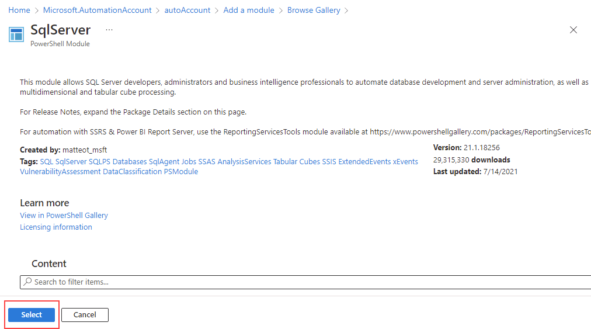
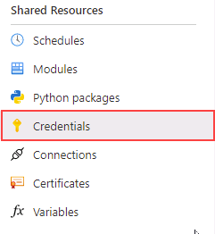
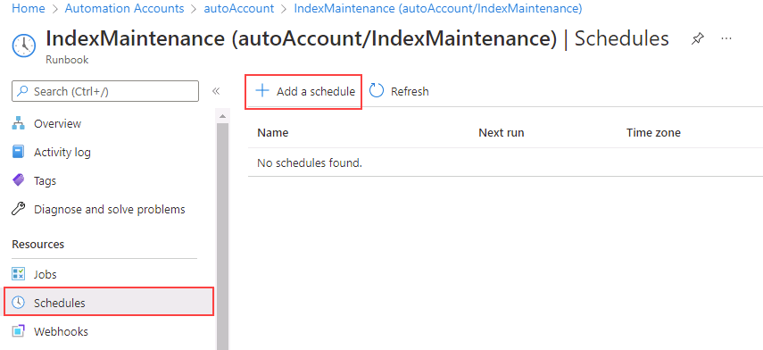

---
lab:
  title: "Labo\_13\_: Déployer un runbook Automation pour reconstruire automatiquement les index"
  module: Automate database tasks for Azure SQL
---

# Déployer un runbook Automation pour reconstruire automatiquement les index

**Durée estimée : 30 minutes**

Vous avez été embauché en tant qu’administrateur de bases de données senior pour aider à automatiser les opérations quotidiennes d’administration de base de données. Cette automatisation a pour objectif de s’assurer que les bases de données pour AdventureWorks continuent de fonctionner à des performances optimales, ainsi que de fournir des méthodes pour générer des alertes en fonction de certains critères. AdventureWorks utilise SQL Server à la fois comme infrastructure en tant que service (IaaS) et plateforme en tant que service (PaaS).

**Remarque :** Ces exercices peuvent vous demander de copier et coller du code T-SQL et d’utiliser des ressources SQL existantes. Vérifiez que le code a été copié correctement, avant de l’exécuter.

## Créer un compte Automation

1. Depuis la machine virtuelle du labo, démarrez une session de navigateur et naviguez vers [https://portal.azure.com](https://portal.azure.com/). Connectez-vous au portail à l’aide du **nom d’utilisateur** et du **mot de passe** Azure fournis dans l’onglet **Ressources** de cette machine virtuelle de labo.

    

1. Dans le Portail Azure, dans la barre de recherche, tapez *Automation*, puis sélectionnez **Comptes Automation** dans les résultats de la recherche, puis cliquez sur **+ Créer**.

    

1. Sur la page **Créer un compte Automation**, saisissez les informations ci-dessous, puis sélectionnez **Vérifier + Créer**.

    - **Groupe de ressources** : &lt;Votre groupe de ressources.&gt;
    - **Nom** : autoAccount
    - **Emplacement** : utilisez la valeur par défaut.

    

1. Dans la page Vérifier, sélectionnez **Créer**.

    

    > [!NOTE]
    > Votre compte Automation devrait être créé dans les trois minutes.

## Se connecter à une base de données Azure SQL

1. Dans le Portail Azure, accédez à votre base de données en recherchant les **bases de données SQL**.

    

1. Sélectionnez la base de données SQL **AdventureWorksLT**.

    

1. Dans la section principale de la page de votre base de données SQL, sélectionnez **Éditeur de requêtes (préversion)**.

    

1. Vous serez invité à entrer vos informations d’identification pour vous connecter à votre base de données. Utilisez ces informations d’identification :

    - **Identifiant de connexion :** sqladmin
    - **Mot de passe** : P@ssw0rd01

1. Vous devriez obtenir le message d’erreur suivant :

    

1. Sélectionnez le lien **Liste d’adresses IP autorisées…** fourni à la fin du message d’erreur ci-dessus. Cela ajoutera automatiquement votre adresse IP client comme entrée de règle de pare-feu pour votre base de données SQL.

    

1. Revenez à l’Éditeur de requête, puis sélectionnez **OK**pour vous connecter à votre base de données.

1. Ouvrez un nouvel onglet dans votre navigateur et naviguez vers la page GitHub pour accéder au script [**AdaptativeIndexDefragmentation**](https://github.com/microsoft/tigertoolbox/blob/master/AdaptiveIndexDefrag/usp_AdaptiveIndexDefrag.sql). Sélectionnez ensuite **Brut**.

    

    Cela affiche le code dans un format que vous pouvez copier. Sélectionnez tout le texte (<kbd>Ctrl</kbd> + <kbd>A</kbd>), puis copiez-le dans le Presse-papiers ( <kbd>Ctrl</kbd> + <kbd>C</kbd>).

    >[!NOTE]
    > Le but de ce script est d’effectuer une défragmentation intelligente sur un ou plusieurs index, ainsi que la mise à jour des statistiques requises, pour une ou plusieurs bases de données.

1. Fermez l’onglet du navigateur GitHub et revenez dans le portail Azure.

1. Collez le texte que vous avez copié dans le volet **Requête 1**.

    

1. Supprimez `USE msdb` et `GO` sur les lignes 5 et 6 de la requête (qui sont mises en surbrillance dans la capture d’écran), puis sélectionnez **Exécuter**.

1. Développez le dossier **Procédures stockées** pour voir ce qui a été créé.

    

## Configurer les ressources du compte Automation

Les étapes suivantes consistent à configurer les ressources nécessaires pour préparer la création du runbook. Sélectionnez ensuite **Comptes Automation**.

1. Dans le portail Azure, dans la zone de recherche supérieure, tapez **automation**.

    

1. Sélectionnez le compte Automation que vous venez de créer.

    

1. Sélectionnez **Modules** dans la section **Ressources partagées** du volet Automation. Sélectionnez ensuite **Parcourir la galerie**.

    

1. Recherchez **sqlserver** dans la Galerie.

    

1. Sélectionnez **SqlServer** afin d’accéder à l’écran suivant, puis sélectionnez **Sélectionner**.

    

1. Sur la page **Ajouter un module**, sélectionnez la dernière version du runtime disponible, puis sélectionnez **Importer**. Le module PowerShell est alors importé dans votre compte Automation.

    

1. Vous devez créer des informations d’identification pour vous connecter de manière sécurisée à votre base de données. Dans le volet du compte Automation, accédez à la section **Ressources partagées** et sélectionnez **Informations d’identification**.

    

1. Sélectionnez **+ Ajouter des informations d’identification**, entrez les informations ci-dessous, puis sélectionnez **Créer**.

    - Nom : **SQLUser**
    - Nom d’utilisateur : **sqladmin**
    - Mot de passe : **P@ssw0rd01**
    - Confirmer le mot de passe : **P@ssw0rd01**

    

## Créer un runbook PowerShell

1. Dans le Portail Azure, accédez à votre base de données en recherchant les **bases de données SQL**.

    

1. Sélectionnez la base de données SQL **AdventureWorksLT**.

    

1. Sur la page **Vue d’ensemble**, copiez le **Nom du serveur** de votre Azure SQL Database comme indiqué ci-dessous. (Le nom de votre serveur doit commencer par *dp300-lab*). Vous le collerez lors des étapes ultérieures.

    

1. Dans le portail Azure, dans la zone de recherche supérieure, tapez **automation**.

    

1. Sélectionnez le compte Automation que vous venez de créer.

    

1. Faites défiler jusqu’à la section **Automatisation des processus** du volet Compte Automation et sélectionnez **Runbooks**, puis **+ Créer un runbook**.

    

    >[!NOTE]
    > Comme nous l’avons appris, notez qu’il existe deux runbooks existants créés. Ils ont été créés automatiquement lors du déploiement du compte Automation.

1. Entrez **IndexMaintenance** comme nom du runbook et **PowerShell** comme type de runbook. Sélectionnez la dernière version du runtime disponible, puis sélectionnez **Créer**.

    

1. Une fois le runbook créé, copiez et collez l’extrait de code PowerShell ci-dessous dans votre éditeur de runbook. Sur la première ligne du script, collez le nom du serveur que vous avez copié dans les étapes ci-dessus. Sélectionnez **Enregistrer**, puis **Publier**.

    **Remarque** : veuillez vérifier que le code a été copié correctement avant d’enregistrer le runbook.

    ```powershell
    $AzureSQLServerName = ''
    $DatabaseName = 'AdventureWorksLT'
    
    $Cred = Get-AutomationPSCredential -Name "SQLUser"
    $SQLOutput = $(Invoke-Sqlcmd -ServerInstance $AzureSQLServerName -UserName $Cred.UserName -Password $Cred.GetNetworkCredential().Password -Database $DatabaseName -Query "EXEC dbo.usp_AdaptiveIndexDefrag" -Verbose) 4>&1

    Write-Output $SQLOutput
    ```

    

1. Si tout se passe bien, vous devriez recevoir un message de réussite.

    

## Créer une planification pour un runbook

Ensuite, vous allez planifier l’exécution régulière du runbook.

1. Sous **Ressources** dans le volet de navigation gauche de votre runbook **IndexMaintenance**, sélectionnez **Planifications**. Sélectionnez **+ Ajouter une planification**.

    

1. Sélectionnez **Associer une planification à votre runbook**.

    

1. Sélectionnez **+ Ajouter une planification**.

    

1. Spécifiez un nom de planification descriptif et une description si vous le souhaitez.

1. Spécifiez comme heure de début **4:00** le jour suivant, dans le fuseau horaire **Heure du Pacifique**. Configurez une fréquence de répétition tous les **1** jour. Ne définissez pas d’expiration.

    

1. Sélectionnez **Créer**, puis **OK**.

1. La planification est maintenant créée et associée au runbook. Cliquez sur **OK**.

    

Azure Automation fournit un service de configuration et d’automatisation basé sur le cloud qui prend en charge la gestion cohérente dans vos environnements Azure et non-Azure.

Cet exercice vous a permis d’automatiser la défragmentation d’index sur une base de données SQL Server pour qu’elle s’exécute tous les jours à quatre heures du matin.