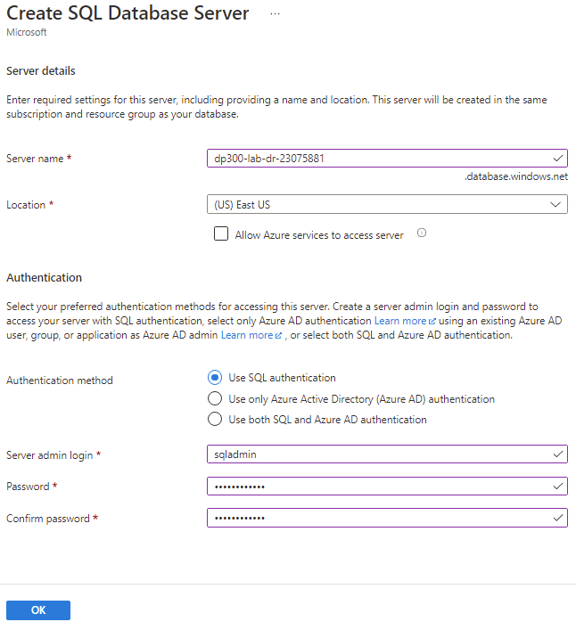
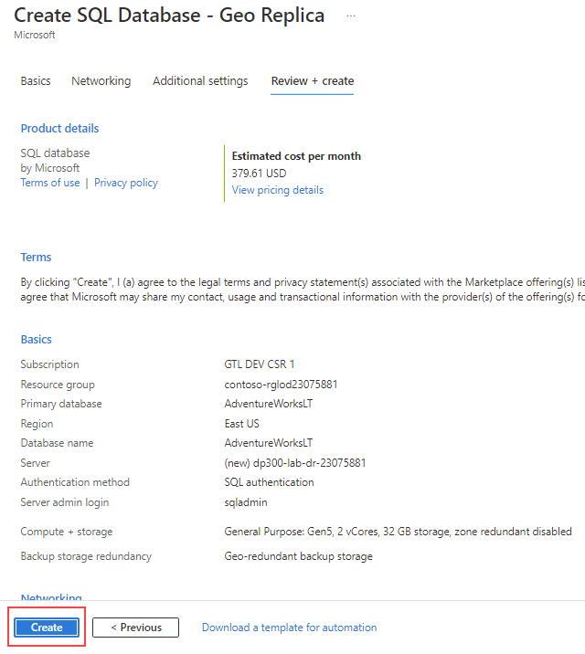
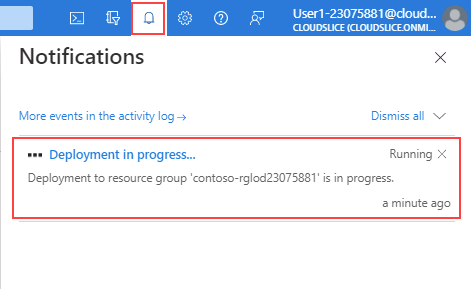
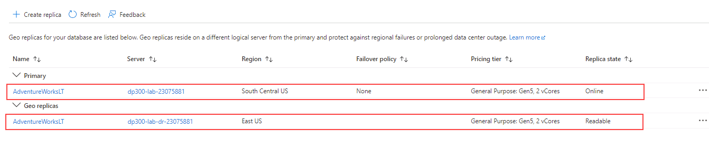

---
lab:
  title: "Labo\_14\_: Configurer la géoréplication pour Azure SQL Database"
  module: Plan and implement a high availability and disaster recovery solution
---

# Configurer la géoréplication pour Azure SQL Database

**Durée estimée : 30 minutes**

En tant qu’administrateur de base de données au sein d’AdventureWorks, vous devez activer la géoréplication pour Azure SQL Database, et vous assurer qu’elle fonctionne correctement. De plus, vous le basculerez manuellement vers une autre région à l’aide du portail.

**Remarque :** Ces exercices peuvent vous demander de copier et coller du code T-SQL et d’utiliser des ressources SQL existantes. Vérifiez que le code a été copié correctement, avant de l’exécuter.

## Activer la géoréplication

1. Depuis la machine virtuelle du labo, démarrez une session de navigateur et naviguez vers [https://portal.azure.com](https://portal.azure.com/). Connectez-vous au portail à l’aide du **nom d’utilisateur** et du **mot de passe** Azure fournis dans l’onglet **Ressources** de cette machine virtuelle de labo.

    

1. Dans le Portail Azure, accédez à votre base de données en recherchant les **bases de données SQL**.

    

1. Sélectionnez la base de données SQL **AdventureWorksLT**.

    

1. Dans le panneau de la base de données, dans la section **Gestion des données**, sélectionnez **Réplicas**.

    

1. Sélectionnez **+ Créer un réplica**.

    

1. Sur la page **Créer une base de données SQL - Géoréplica**, sous **Serveur**, sélectionnez le lien **Créer**.

    

    >[!NOTE]
    > Comme nous créons un nouveau serveur pour héberger notre base de données secondaire, nous pouvons ignorer le message d’erreur ci-dessus.

1. Sur la page **Créer un serveur SQL Database**, entrez un **nom de serveur** unique au choix, un **identifiant de connexion d’administrateur de serveur** valide et un **mot de passe** sécurisé. Sélectionnez un **emplacement** comme région cible, puis cliquez sur **OK** pour créer le serveur.

    

1. Revenez à la page **Créer une base de données SQL - Géo-réplica**, puis sélectionnez **Vérifier + créer**.

    

1. Sélectionnez **Créer**.

    

1. Le serveur secondaire et la base de données sont à présent créés. Pour vérifier le statut, regardez sous l’icône de notification en haut du portail. 

    

1. Si l’opération a réussi, il passe de **Déploiement en cours** à **Déploiement effectué**.

    

## Basculement d’une base de données SQL vers une région secondaire

Une fois le réplica Azure SQL Database créé, vous allez effectuer un basculement.

1. Accédez à la page des serveurs SQL et remarquez le nouveau serveur dans la liste. Sélectionnez le serveur secondaire. (Vous pouvez avoir un nom de serveur différent).

    

1. Dans le volet SQL Server, dans la section **Paramètres**, cliquez sur **Bases de données SQL**.

    

1. Dans le panneau principal de la base de données SQL, dans la section **Gestion des données**, sélectionnez **Réplicas**.

    

1. Notez que le lien de géoréplication est maintenant établi.

    

1. Sélectionnez le menu **…** du serveur secondaire, puis sélectionnez **Basculement forcé**.

    

    > [!NOTE]
    > Le basculement forcé fait passer la base de données secondaire au rôle principal. Toutes les sessions sont déconnectées pendant cette opération.

1. Lorsque le message d’avertissement vous y invite, cliquez sur **Oui**.

    

1. L’état du réplica principal passe à **En attente** et celui du réplica secondaire à **Basculement**. 

    

    > [!NOTE]
    > Ce processus peut prendre quelques minutes. Lorsqu’il est terminé, les rôles basculent avec le réplica secondaire qui devient le nouveau principal, et l’ancien principal qui se retrouve le secondaire.

Nous avons vu que la base de données secondaire accessible en lecture peut être dans la même région Azure que la base de données primaire, ou, plus communément, dans une autre région. Ce type de base de données secondaire accessible en lecture est également appelé géo-secondaires ou géo-réplicas.

Vous avez maintenant vu comment activer les géo-réplicas pour Azure SQL Database et la basculer manuellement vers une autre région à l’aide du portail.
