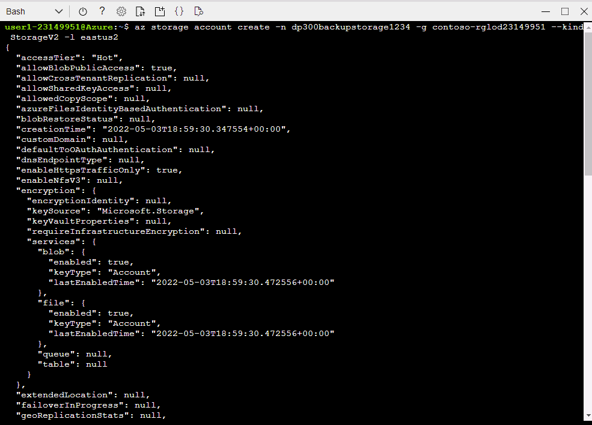
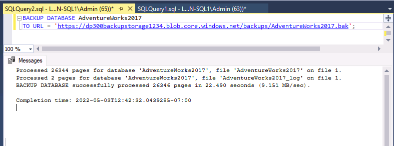

---
lab:
  title: "Labo\_15\_: Sauvegarder sur une URL et restaurer à partir d’une URL"
  module: Plan and implement a high availability and disaster recovery solution
---

# Sauvegarde vers une URL

**Durée estimée : 30 minutes**

En tant qu’administrateur de base données pour AdventureWorks, vous devez sauvegarder une base de données vers une URL dans Azure et la restaurer à partir du stockage Blob Azure à la suite d’une erreur humaine.

## Restaurer une base de données

1. Téléchargez le fichier de sauvegarde de la base de données situé sur **https://github.com/MicrosoftLearning/dp-300-database-administrator/blob/master/Instructions/Templates/AdventureWorks2017.bak** à l’emplacement **C:\LabFiles\HADR** sur la machine virtuelle du labo (créez la structure du dossier si elle n’existe pas).

    

1. Sélectionnez le bouton Démarrer de Windows et tapez SSMS. Sélectionnez **Microsoft SQL Server Management Studio 18** dans la liste.  

    

1. Lorsque SSMS s’ouvre, remarquez que la boîte de dialogue **Se connecter au serveur** est préremplie avec le nom de l’instance par défaut. Sélectionnez **Connecter**.

    

1. Sélectionnez le dossier **Bases de données**, puis **Nouvelle requête**.

    

1. Dans la nouvelle fenêtre de requête, copiez et collez le code T-SQL ci-dessous. Exécutez la requête pour restaurer la base de données.

    ```sql
    RESTORE DATABASE AdventureWorks2017
    FROM DISK = 'C:\LabFiles\HADR\AdventureWorks2017.bak'
    WITH RECOVERY,
          MOVE 'AdventureWorks2017' 
            TO 'C:\LabFiles\HADR\AdventureWorks2017.mdf',
          MOVE 'AdventureWorks2017_log'
            TO 'C:\LabFiles\HADR\AdventureWorks2017_log.ldf';
    ```

    **Remarque** : le nom et le chemin du fichier de sauvegarde de la base de données doivent correspondre à ceux que vous avez téléchargés à l’étape 1, sinon la commande échouera.

1. Vous devriez voir un message de réussite une fois la restauration terminée.

    

## Configurer la sauvegarde vers une URL

1. Depuis la machine virtuelle du labo, démarrez une session de navigateur et naviguez vers [https://portal.azure.com](https://portal.azure.com/). Connectez-vous au portail à l’aide du **nom d’utilisateur** et du **mot de passe** Azure fournis dans l’onglet **Ressources** de cette machine virtuelle de labo.

    

1. Ouvrez une invite **Cloud Shell** en sélectionnant l’icône encadrée ci-dessous.

    

1. Dans la moitié inférieure du portail, vous verrez peut-être un message de bienvenue à Azure Cloud Shell si vous ne l’avez pas encore utilisé. Sélectionnez **Bash**.

    

1. Si vous n’avez pas encore utilisé Cloud Shell, vous devez configurer un stockage. Sélectionnez **Afficher les paramètres avancés**. (Il se peut qu’un autre abonnement vous soit attribué).

    

1. Sous **Groupe de ressources**, choisissez l’utilisation d’un groupe existant. Spécifiez de nouveaux noms sous **Compte de stockage** et **Partage de fichiers** comme indiqué dans la boîte de dialogue ci-dessous. Notez le nom du **Groupe de ressources**. Il doit commencer par *contoso-rg*. Sélectionnez ensuite **Créer le stockage**.

    **Remarque** : le nom de votre compte de stockage doit être unique et comporter uniquement des minuscules, sans caractères spéciaux. Veuillez fournir un nom unique.

    

1. Une fois l’opération terminée, une invite semblable à celle présentée ci-dessous s’affiche. Vérifiez que vous voyez **Bash** dans l’angle supérieur gauche de l’écran Cloud Shell.

    

1. Créez un compte de stockage à partir de l’interface CLI en exécutant la commande suivante dans Cloud Shell. Utilisez le nom du groupe de ressources commençant par **contoso-rg**, que vous avez noté plus haut.

    > [!NOTE]
    > Modifiez le nom du groupe de ressources (paramètre **-g**) et fournissez un nom de compte de stockage unique (paramètre **-n**).

    ```bash
    az storage account create -n "dp300backupstorage1234" -g "contoso-rglod23149951" --kind StorageV2 -l eastus2
    ```

    

1. Vous obtiendrez ensuite les clés de votre compte de stockage, que vous utiliserez dans les étapes suivantes. Exécutez le code suivant dans Cloud Shell en utilisant le nom unique de votre compte de stockage et de votre groupe de ressources.

    ```bash
    az storage account keys list -g contoso-rglod23149951 -n dp300backupstorage1234
    ```

    Votre clé de compte figurera dans les résultats de la commande ci-dessus. Veillez à utiliser le même nom (après le **-n**) et le même groupe de ressources (après le **-g**) que ceux utilisés dans la commande précédente. Copiez la valeur retournée pour **key1** (sans les guillemets doubles) comme indiqué ici :

    

1. La sauvegarde d’une base de données dans SQL Server vers une URL utilise un conteneur dans un compte de stockage. Vous allez créer un conteneur spécifiquement pour le stockage de sauvegarde dans cette étape. Pour ce faire, exécutez les commandes ci-dessous.

    ```bash
    az storage container create --name "backups" --account-name "dp300backupstorage1234" --account-key "storage_key" --fail-on-exist
    ```

    Où **dp300backupstorage1234** est le nom unique du compte de stockage utilisé à sa création et **storage_key** la clé générée précédemment. La sortie doit retourner la valeur **true**.

    

1. Pour vérifier si les sauvegardes du conteneur ont été créées correctement, exécutez :

    ```bash
    az storage container list --account-name "dp300backupstorage1234" --account-key "storage_key"
    ```

    Où **dp300backupstorage1234** est le nom unique du compte de stockage utilisé à sa création et **storage_key** la clé générée. La sortie doit retourner un résultat similaire à ce qui suit :

    

1. Une signature d’accès partagé doit être générée au niveau du conteneur à des fins de sécurité. Pour cela, vous pouvez utiliser Cloud Shell ou PowerShell. Exécutez la commande suivante :

    ```bash
    az storage container generate-sas -n "backups" --account-name "dp300backupstorage1234" --account-key "storage_key" --permissions "rwdl" --expiry "date_in_the_future" -o tsv
    ```

    Où **dp300backupstorage1234** est le nom unique du compte de stockage utilisé lors de la création du compte de stockage, **storage_key** est la clé générée et **date_in_the_future** est une date ultérieure à aujourd’hui. La valeur **date_in_the_future** doit être au format UTC, par exemple **2021-12-31T00:00Z** pour spécifier une expiration le 31 décembre 2020 à minuit.

    La sortie doit retourner un résultat similaire à ce qui suit. Copiez l’intégralité de la signature d’accès partagé et collez-la dans le **bloc-notes**. Elle sera utilisée pour la tâche suivante.

    

## Créer des informations d’identification

La fonctionnalité est maintenant configurée. Vous pouvez à présent générer un fichier de sauvegarde sous forme d’objet blob dans le compte de stockage Azure.

1. Démarrez **SSMS (SQL Server Management Studio)**.

1. Vous êtes invité à vous connecter à SQL Server. Vérifiez que l’option **Authentification Windows** est sélectionnée, puis sélectionnez **Se connecter**.

1. Sélectionnez **Nouvelle requête**.

1. Créez les informations d’identification qui seront utilisées pour accéder au stockage dans le cloud avec le code Transact-SQL suivant. Renseignez les valeurs appropriées, puis sélectionnez **Exécuter**.

    ```sql
    IF NOT EXISTS  
    (SELECT * 
        FROM sys.credentials  
        WHERE name = 'https://<storage_account_name>.blob.core.windows.net/backups')  
    BEGIN
        CREATE CREDENTIAL [https://<storage_account_name>.blob.core.windows.net/backups]
        WITH IDENTITY = 'SHARED ACCESS SIGNATURE',
        SECRET = '<key_value>'
    END;
    GO  
    ```

    Les deux occurrences de **<storage_account_name>** correspondent au nom unique du compte de stockage et **<key_value>** est la valeur générée à la fin de la tâche précédente, dans ce format :

    `'se=2020-12-31T00%3A00Z&sp=rwdl&sv=2018-11-09&sr=csig=rnoGlveGql7ILhziyKYUPBq5ltGc/pzqOCNX5rrLdRQ%3D'`

1. Vous pouvez vérifier si les informations d’identification ont été créées correctement en accédant à **Sécurité -> Informations d’identification** dans l’Explorateur d’objet.

    

1. En cas d’erreur de saisie, si vous devez recréer les informations d’identification, vous pouvez les supprimer à l’aide de la commande suivante, en veillant à modifier le nom du compte de stockage :

    ```sql
    -- Only run this command if you need to go back and recreate the credential! 
    DROP CREDENTIAL [https://<storage_account_name>.blob.core.windows.net/backups]  
    ```

## Sauvegarde vers une URL

1. Sauvegardez la base de données **AdventureWorks2017** dans Azure avec la commande Transact-SQL suivante :

    ```sql
    BACKUP DATABASE AdventureWorks2017   
    TO URL = 'https://<storage_account_name>.blob.core.windows.net/backups/AdventureWorks2017.bak';
    GO 
    ```

    Où **<storage_account_name>** est le nom unique de compte de stockage utilisé. La sortie doit retourner un résultat similaire à ce qui suit.

    

    En cas de configuration incorrecte, un message d’erreur semblable à celui présenté ci-dessous s’affiche :

    

    Si une erreur se produit, vérifiez que vous n’avez pas fait d’erreur de saisie lors de la création des informations d’identification et que tout a bien été créé.

## Valider la sauvegarde via Azure CLI

Pour vérifier si le fichier est effectivement dans Azure, vous pouvez utiliser l’Explorateur Stockage (préversion) ou Azure Cloud Shell.

1. Démarrez une session de navigation et accédez à [https://portal.azure.com](https://portal.azure.com/). Connectez-vous au portail à l’aide du **nom d’utilisateur** et du **mot de passe** Azure fournis dans l’onglet **Ressources** de cette machine virtuelle de labo.

1. Utilisez Azure Cloud Shell pour exécuter cette commande Azure CLI :

    ```bash
    az storage blob list -c "backups" --account-name "dp300backupstorage1234" --account-key "storage_key" --output table
    ```

    Veillez à utiliser le même nom de compte de stockage unique (après **--account-name**) et la même clé de compte (après **--account-key**) que dans les commandes précédentes.

    

    Nous pouvons confirmer que le fichier de sauvegarde a été correctement généré.

## Valider la sauvegarde via l’explorateur de stockage

1. Pour utiliser l’Explorateur Stockage (préversion), sélectionnez **Comptes de stockage** dans la page d’accueil du portail Azure.

    

1. Sélectionnez le nom unique du compte de stockage que vous avez créé pour les sauvegardes.

1. Dans le volet de navigation de gauche, sélectionnez **Navigateur de stockage (préversion)**. Développez **Conteneurs d’objets blob**.

    

1. Sélectionnez **Sauvegardes**.

    

1. Notez que le fichier de sauvegarde est stocké dans le conteneur.

    

## Restaurer à partir de l'URL

Cette tâche vous montre comment restaurer une base de données à partir d’un Stockage Blob Azure.

1. À partir de **SQL Server Management Studio (SSMS),** sélectionnez **Nouvelle requête**, puis collez et exécutez la requête suivante.

    ```sql
    USE AdventureWorks2017;
    GO
    SELECT * FROM Person.Address WHERE AddressId = 1;
    GO
    ```

    

1. Exécutez cette commande pour modifier le nom de ce client.

    ```sql
    UPDATE Person.Address
    SET AddressLine1 = 'This is a human error'
    WHERE AddressId = 1;
    GO
    ```

1. Exécutez de nouveau l’**étape 1** pour vérifier que l’adresse a été modifiée. À présent, imaginez que quelqu’un ait modifié des milliers ou des millions de lignes sans clause WHERE ou avec une clause WHERE incorrecte. L’une des solutions consiste à restaurer la base de données à partir de la dernière sauvegarde disponible.

    

1. Pour restaurer la base de données à l’état précédent la modification par erreur du nom du client, procédez comme suit.

    **Remarque** : définissez la syntaxe **SINGLE_USER** sur la restauration immédiate pour que toutes les transactions ouvertes soient restaurées. Cela permet d’éviter que la restauration n’échoue en raison de connexions actives.

    ```sql
    USE [master]
    GO

    ALTER DATABASE AdventureWorks2017 SET SINGLE_USER WITH ROLLBACK IMMEDIATE
    GO

    RESTORE DATABASE AdventureWorks2017 
    FROM URL = 'https://<storage_account_name>.blob.core.windows.net/backups/AdventureWorks2017.bak'
    GO

    ALTER DATABASE AdventureWorks2017 SET MULTI_USER
    GO
    ```

    Où **<storage_account_name>** est le nom unique de compte de stockage que vous avez créé.

    La sortie doit ressembler à ce qui suit :

    

1. Exécutez de nouveau l’**étape 1** pour vérifier que le nom du client a été restauré.

    

Il est important de comprendre les composants et leur interaction pour effectuer une sauvegarde ou une restauration à l’aide du service Stockage Blob Azure.

Vous avez vu que vous pouvez sauvegarder une base de données vers une URL dans Azure et, si nécessaire, la restaurer.
